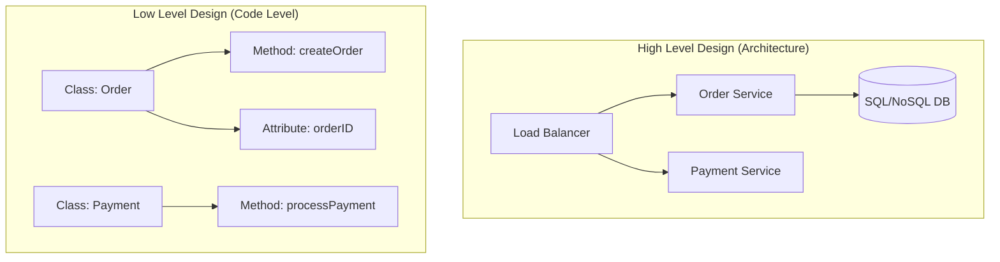

# Low-Level Design (LLD):

## 📌 HLD vs. LLD: The Big Picture

| Feature | High-Level Design (HLD) 🏗️ | Low-Level Design (LLD) 💻 |
| :--- | :--- | :--- |
| **Focus** | Overall System Architecture | Internal Design of Components |
| **Scope** | Services, Databases, Networking | Classes, Methods, Logic |
| **Key Topics** | Microservices, Load Balancers, CDN | Class Relations, Algorithms, Schemas |
| **Examples** | Payment Service, Order Service | `Order` Class, `createOrder()` method |

### 🎯 Core Focus of LLD
1. **Scalability 📈**: Handling large volumes while keeping code structure easy to expand.
2. **Maintainability 🛠️**: Ensuring new features don't break existing ones; easy debugging.
3. **Reusability 🔄**: Modules should be "plug-and-play" (e.g., modular notification services).

### HLD vs LLD Comparison

---
Table of contents:

### 1. 🔐 [Access Modifiers](accessModifiers/README.md)
### 2. 🏛️ [Pillars of OOPs](pillersOfOops/README.md)
### 3. 🏗️ [UML Diagrams](umlDiagrams/README.md)
