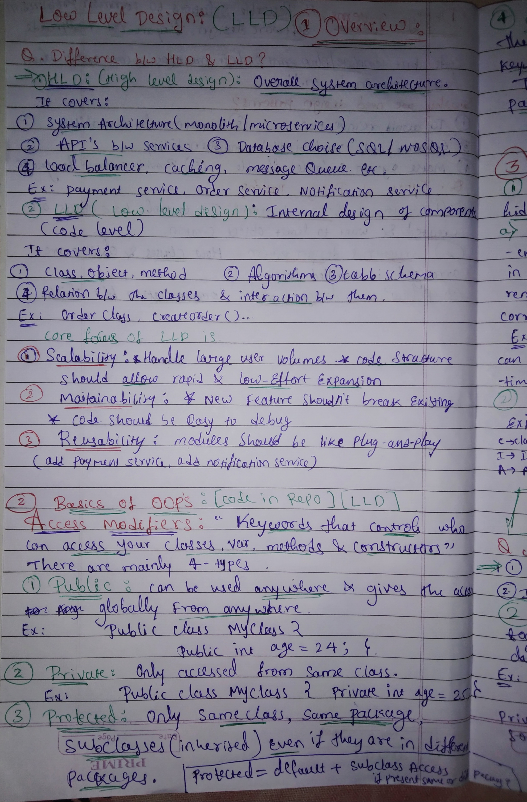
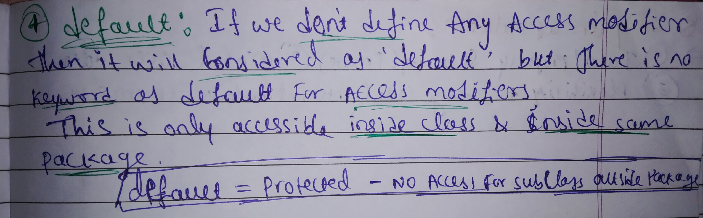
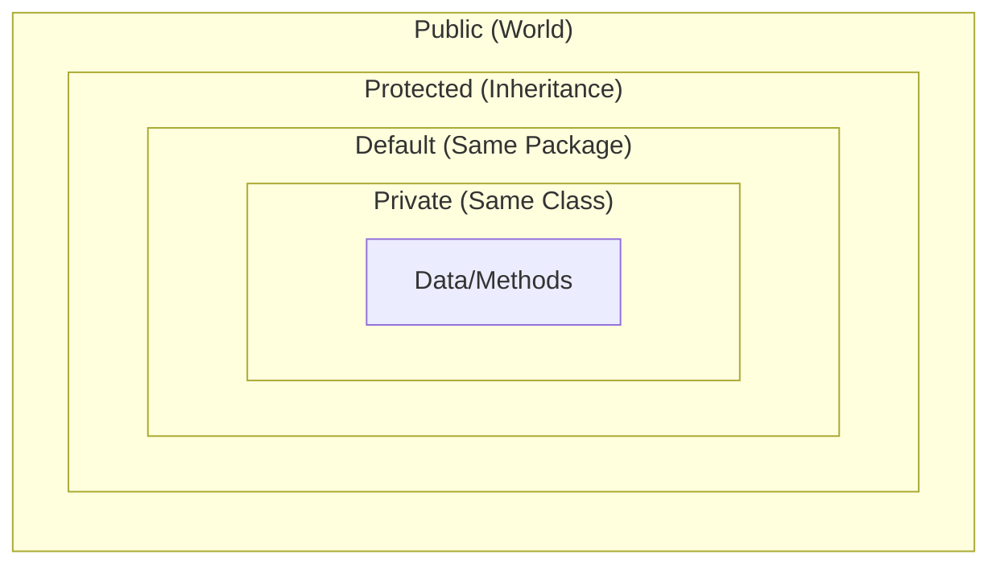

## 🔐 Access Modifiers in Java

Notes:
<p align="center">
  </img><br>
  </img>
</p>

Access modifiers are keywords that control the **visibility** and **accessibility** of classes, variables, methods, and constructors.
This folder demonstrates each modifier with small runnable examples and intentionally commented lines that would fail compilation.

### 📊 Visibility Matrix

The following table summarizes where each modifier allows access:

| Modifier | Same Class | Same Package | Subclass (Outside Pkg) | World |
| :--- | :---: | :---: | :---: | :---: |
| **`public`** | ✅ | ✅ | ✅ | ✅ |
| **`protected`** | ✅ | ✅ | ✅ | ❌ |
| **`default`** | ✅ | ✅ | ❌ | ❌ |
| **`private`** | ✅ | ❌ | ❌ | ❌ |

---

### 🔍 Deep Dive into Modifiers

#### 1. Public 🌍
Accessible **anywhere** in the project.

From `publicAcessModifier/Public.java`:
```java
public class Public {
    public int age = 24;

    public Public() {
        System.out.println("public constructor");
    }

    public void sayHello() {
        System.out.println("Hello !");
    }
}
```

**Takeaway:** class, constructor, field, and method can all be public and accessed from any package.

#### 2. Private 🔒
Accessible **only** within the same class.

From `privateAcessModifier/Private.java`:
```java
public class Private {
    private int age = 24;
    private Private() { }
    private void sayHello() { }
    private class InnerClass {
        private String name = "Sid";
    }
}
```

From `privateAcessModifier/accessPrivateFields.java` (intentionally invalid, kept commented in source):
```java
// Private aPrivate = new Private();
// aPrivate.sayHello();
// Private.InnerClass innerClass = aPrivate.new InnerClass();
// aPrivate.age = 100;
```

**Takeaway:** private is strict class-level encapsulation; even same-package classes cannot access private members.

#### 3. Protected 🛡️
Accessible within the **same package** and by **subclasses** (inheritance), even if those subclasses are in different packages.
> **Formula:** `Protected` = `Default` + Subclass Access.

From `protectedAccessModifier/SamePackageSubClass.java`:
- Direct same-package access works through `Protected` instance.
- Subclass access also works through `SamePackageSubClass` instance.

From `protectedAccessModifier/differentPackage/DifferentPackageSubClass.java`:
- Access through base-class instance in different package is commented out (invalid).
- Access through subclass instance works (`differentPackageSubClass.age`, `sayHello()`).

From `protectedAccessModifier/Protected.java`:
- Constructor, field, method, and inner class are all marked `protected`.

**Takeaway:** outside the package, protected access is available through inheritance context, not through arbitrary base-class objects.

#### 4. Default (Package-Private) 📦
Used when no modifier is defined. There is no `default` keyword for this. Accessible **only inside the same package**.
> **Formula:** `Default` = `Protected` - Subclass Access (outside package).

From `defaultAccessModifier/SamePackageClass.java`:
- `new Default()`, `aDefault.age`, `aDefault.sayHello()`, and `Default.InnerClass` all work in the same package.

From `defaultAccessModifier/differentPackage/DifferentPackageClass.java`:
- `new Default()` is commented out because `Default` is package-private and not visible outside its package.

From `defaultAccessModifier/Default.java`:
- Demonstrates package-private class, constructor, field, method, and inner class.

**Takeaway:** default access is package-bound; even subclasses in other packages cannot use it.

---

### ✅ What This Demo Set Teaches Clearly

1. **`private`** is only for code inside the same class.
2. **`default`** is package-scoped and invisible outside that package.
3. **`protected`** adds subclass-based access across package boundaries.
4. **`public`** has no package restriction.
5. Commented lines in demo classes are deliberate examples of invalid access.

---
### Access Modifier Scope Diagram
This diagram shows the expanding levels of visibility for each modifier.



---