## 🧩 Design Patterns: An Overview

## 📑 Table of Contents

* [0. Overview Of Design Patterns](#0-overview)
* [1. The Strategy Design Pattern](#-1-the-strategy-design-pattern)
* [2. Factory Design Pattern](#2-factory-design-pattern)
* [3. Singleton Design Pattern](#3-singleton-design-pattern)
* [4. Observer Design Pattern](#-4-observer-design-pattern)
* [5. Decorator Design Pattern](#-5-decorator-design-pattern)

<a id="0-overview"></a>
**Design Patterns** are proven, reusable solutions to common problems in software design. They are not ready-made code but rather **templates and best practices** used to solve architectural challenges.

### ❓ Why use Design Patterns?
* 🚫 **Avoid Reinvention:** Use battle-tested solutions instead of starting from scratch.
* 🏗️ **Improve Code Structure:** Enhance code readability and maintainability.
* 🛡️ **Follow SOLID:** Naturally aligns code with SOLID principles.

### 📁 Classification of Patterns
| Category | Purpose | Examples |
| :--- | :--- | :--- |
| **Creational** | Deals with how objects are created | Singleton, Factory, Builder |
| **Structural** | Deals with how classes & objects are organized | Proxy, Composite, Adapter |
| **Behavioral** | Deals with communication between objects | Observer, **Strategy**, Command |

---


<a id="-1-the-strategy-design-pattern"></a>
## 🎯 1. The Strategy Design Pattern

Notes:

<p align="center">
  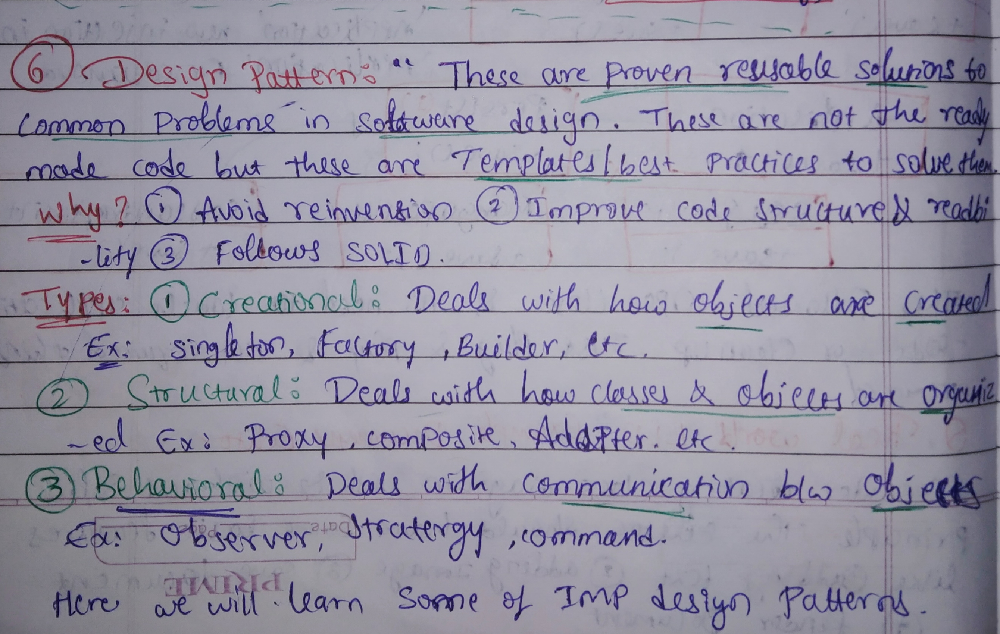</img><br>
  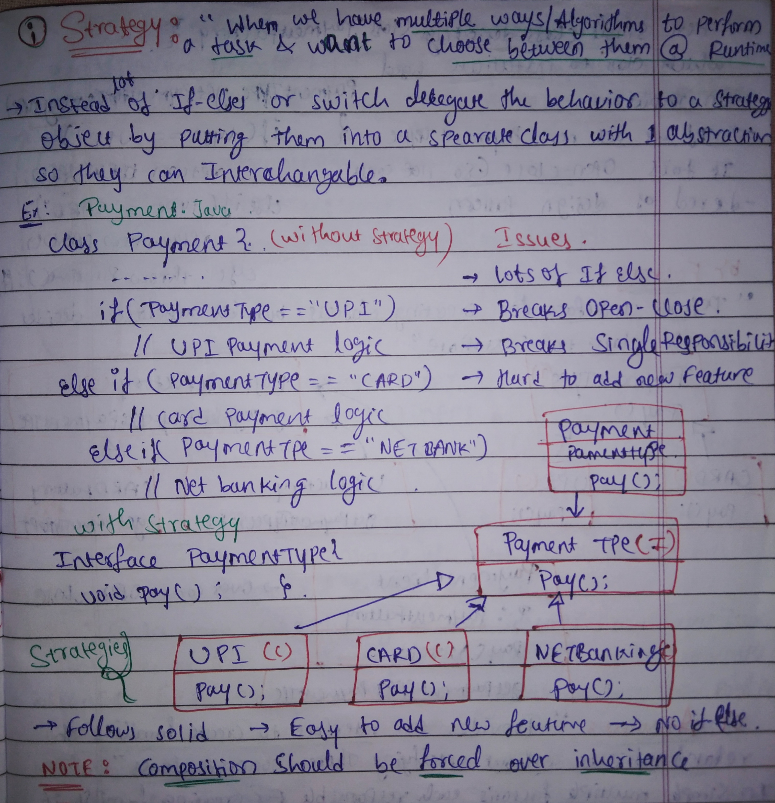</img>
</p>
    
The **Strategy Pattern** is a behavioral design pattern used when we have multiple ways (algorithms) to perform a task and want to choose between them at **runtime**.

> **The Core Idea:** Instead of using massive `if-else` or `switch` blocks, we delegate the behavior to a "Strategy Object" by putting them into separate classes with a common abstraction so they can be **interchangeable**.

### ❌ The Problem: Without Strategy Pattern
Imagine a payment processing system. Using a naive approach leads to several issues:

```java
// Issues:
// 1. Lots of if-else blocks.
// 2. Breaks Open-Closed Principle (Adding a new method requires modifying this class).
// 3. Breaks Single Responsibility Principle.
// 4. Hard to add new features.

class Payment {
    public void pay(String paymentType) {
         switch (paymentType) {
            case "UPI" -> log.info("Paying through UPI");
            case "CARD" -> log.info("Paying through DebitCard");
            case "NETBANKING" -> log.info("Paying through NetBanking");
            default -> throw new InvalidAlgorithmParameterException("This payment type is not acceptable");
        }
    }
}

```

### ✅ The Solution: With Strategy Pattern

We define an interface for the payment strategy and implement it for each payment method.

```java
interface PaymentType {
    void pay();
}

class UPI implements PaymentType {
    @Override
    public void pay() {
        System.out.println("Paying through UPI");
    }
}

class DebitCard implements PaymentType {
    @Override
    public void pay() {
        System.out.println("Paying through DebitCard");
    }
}

public class TestWithStrategy {
    public static void main(String[] args) {
        PaymentType upi = new UPI();
        upi.pay();

        PaymentType card = new DebitCard();
        card.pay();
    }
}
```

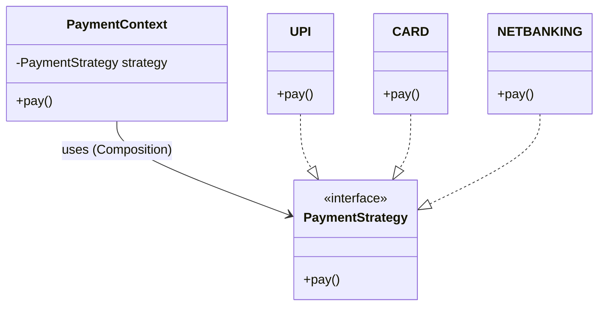
```mermaid
classDiagram
    class PaymentContext {
        -PaymentStrategy strategy
        +pay()
    }
    class PaymentStrategy {
        <<interface>>
        +pay()
    }
    class UPI {
        +pay()
    }
    class CARD {
        +pay()
    }
    class NETBANKING {
        +pay()
    }

    PaymentContext --> PaymentStrategy : uses (Composition)
    UPI ..|> PaymentStrategy
    CARD ..|> PaymentStrategy
    NETBANKING ..|> PaymentStrategy

```
## Standard Class diagram
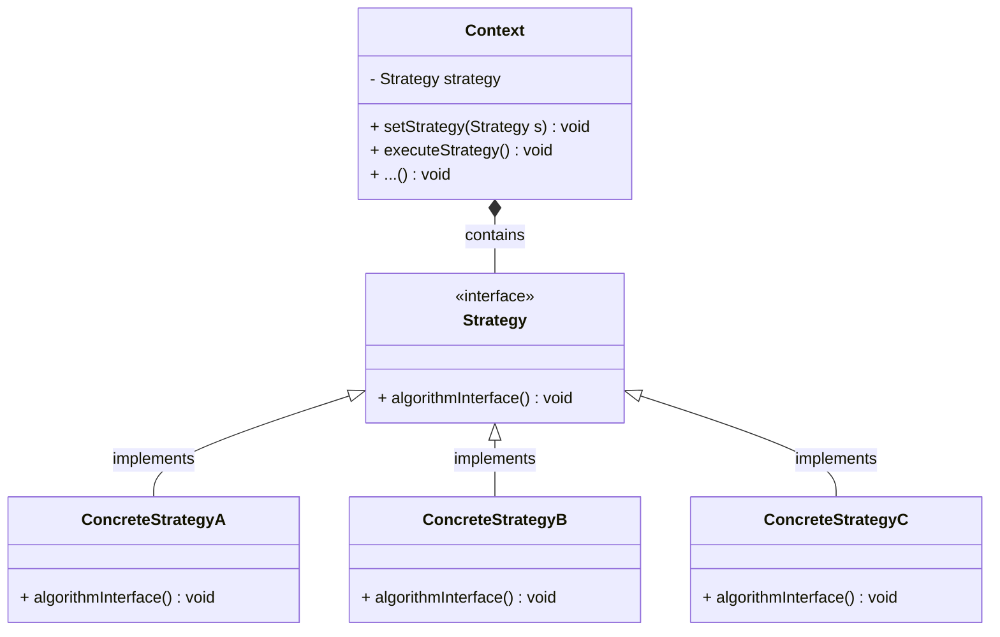
```mermaid
classDiagram
    class Context {
        - Strategy strategy
        + setStrategy(Strategy s) void
        + executeStrategy() void
        + ...() void
    }

    class Strategy {
        <<interface>>
        + algorithmInterface() void
    }

    class ConcreteStrategyA {
        + algorithmInterface() void
    }

    class ConcreteStrategyB {
        + algorithmInterface() void
    }

    class ConcreteStrategyC {
        + algorithmInterface() void
    }

    Context *-- Strategy : contains
    Strategy <|-- ConcreteStrategyA : implements
    Strategy <|-- ConcreteStrategyB : implements
    Strategy <|-- ConcreteStrategyC : implements
```

### 🚀 Key Takeaways

* ✅ **Follows SOLID:** Adheres to the Open-Closed and Single Responsibility principles.
* ✨ **Easy to Extend:** Adding a new feature (e.g., Crypto) is easy—just add a new class.
* 🚫 **No if-else:** Logic is determined by the object passed.
* 🔗 **Composition over Inheritance:** **Note:** Composition should be forced over inheritance for better flexibility.

---


## 2. Factory Design Pattern

Notes:

<p align="center">
  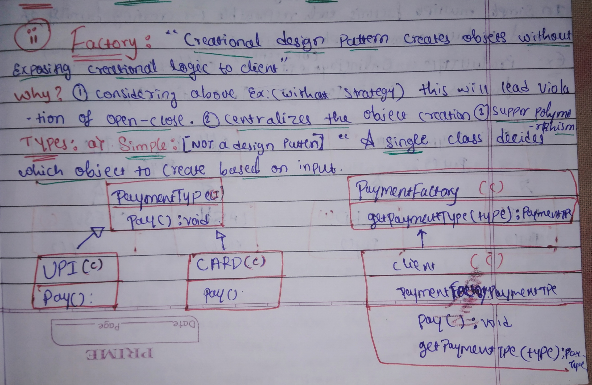</img><br>
  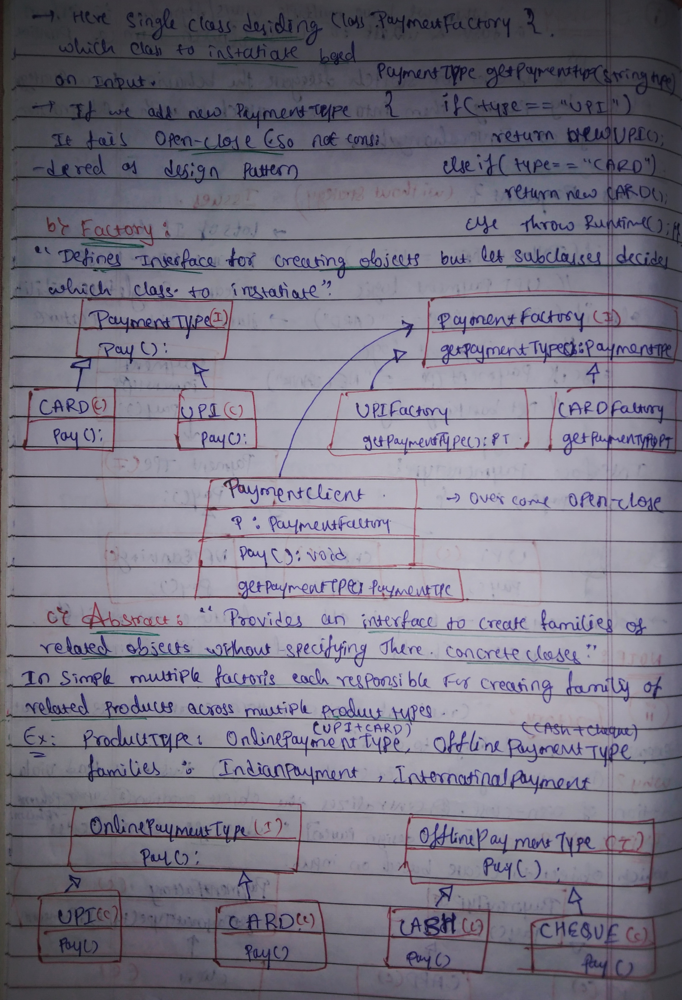</img><br>
  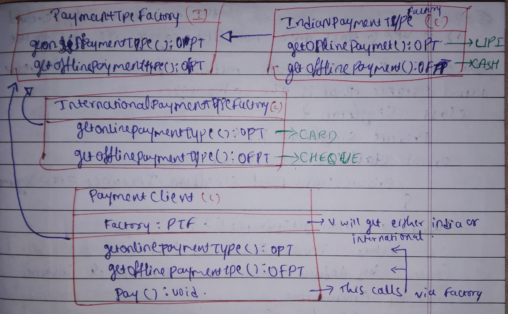</img>
</p>
    
**Factory Design Pattern** family, moving from Simple Factory to Abstract Factory. It is a key **Creational Design Pattern** that focuses on object creation without exposing the instantiation logic to the client.

---

## 🧩  Overview: Why use the Factory Pattern?

In a standard system, creating objects directly using `new` (e.g., `new UPI()`) inside the client code leads to a violation of the **Open-Closed Principle**. If you add a new payment method, you have to modify the client code.

### ✨ Key Benefits:

* 🛡️ **Hides Creation Logic:** The client doesn't need to know *how* an object is created.
* 📦 **Centralized Control:** All instantiation happens in one place.
* 🔗 **Loose Coupling:** Supports polymorphism by returning an interface rather than a concrete class.

---

## 🪜  The Evolution of Factory Patterns

### A. Simple Factory (Not a formal Design Pattern)

A single class with a static method that decides which object to create based on input.

> **Issue:** Every time a new product is added, the `if-else` block in the Factory must be changed, failing the Open-Closed Principle.

```java
// Simple Factory Example
class PaymentFactory {
    public PaymentType getPaymentMethod(String type) {
        if (type.equals("UPI"))
            return new UPI();
        else if (type.equals("CARD"))
            return new Card();
        else
            return null;
    }
}

// Usage
public class TestSimpleFactory {
    public static void main(String[] args) {
        PaymentTypeFactory paymentTypeFactory = new PaymentTypeFactory();
        PaymentType upi = paymentTypeFactory.getPaymentMethod("UPI");
        upi.pay();
        PaymentType card = paymentTypeFactory.getPaymentMethod("CARD");
        card.pay();
    }
}
```

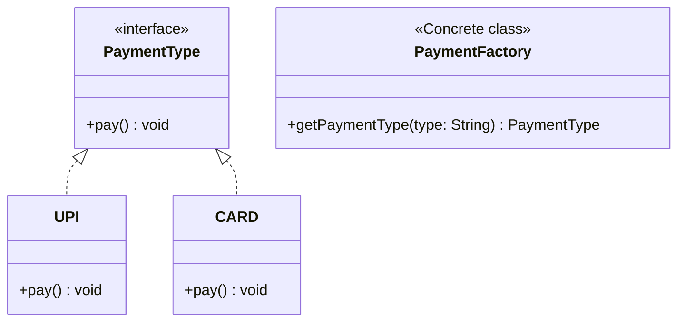
```mermaid
classDiagram
    class PaymentType {
        <<interface>>
        +pay() void
    }
    class UPI {
        +pay() void
    }
    class CARD {
        +pay() void
    }
    class PaymentFactory {
        <<Concrete class>>
        +getPaymentType(type: String) PaymentType
    }

    PaymentType <|.. UPI
    PaymentType <|.. CARD
```

**Standard Class Diagram:**

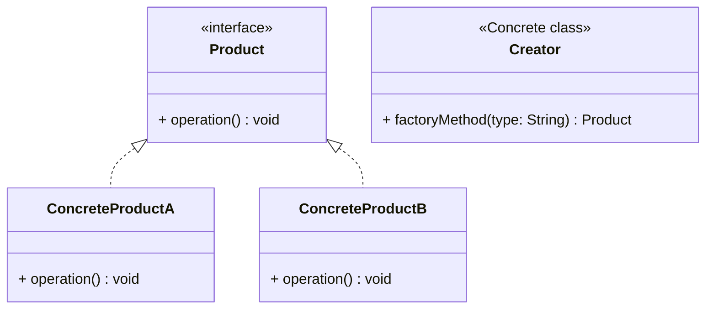
```mermaid
classDiagram
    class Product {
        <<interface>>
        + operation() void
    }

    class ConcreteProductA {
        + operation() void
    }

    class ConcreteProductB {
        + operation() void
    }

    class Creator {
        <<Concrete class>>
        + factoryMethod(type: String) Product
    }

    Product <|.. ConcreteProductA
    Product <|.. ConcreteProductB
```

---

### B. Factory Method Pattern 🛠️

Defines an interface for creating objects but allows **subclasses** to decide which class to instantiate.

```java
// Factory Interface
interface PaymentTypeFactory {
    PaymentType getPaymentMethod();
}

// Concrete Factory 1
class UPIFactory implements PaymentTypeFactory {
    @Override
    public PaymentType getPaymentMethod() {
        return new UPI();
    }
}

// Concrete Factory 2
class CardFactory implements PaymentTypeFactory {
    @Override
    public PaymentType getPaymentMethod() {
        return new Card();
    }
}

// Usage
public class TestFactory {
    public static void main(String[] args) {
        PaymentTypeFactory upiFactory = new UPIFactory();
        PaymentType upi = upiFactory.getPaymentMethod();
        upi.pay();
        
        PaymentTypeFactory cardFactory = new CardFactory();
        PaymentType card = cardFactory.getPaymentMethod();
        card.pay();
    }
}
```

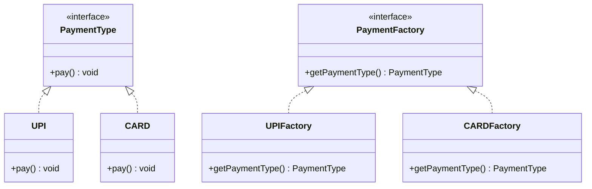
```mermaid
classDiagram
    class PaymentType {
        <<interface>>
        +pay() void
    }
    class UPI { +pay() void }
    class CARD { +pay() void }

    class PaymentFactory {
        <<interface>>
        +getPaymentType() PaymentType
    }
    class UPIFactory {
        +getPaymentType() PaymentType
    }
    class CARDFactory {
        +getPaymentType() PaymentType
    }


    PaymentType <|.. UPI
    PaymentType <|.. CARD
    PaymentFactory <|.. UPIFactory
    PaymentFactory <|.. CARDFactory
```

**Standard Class Diagram:**

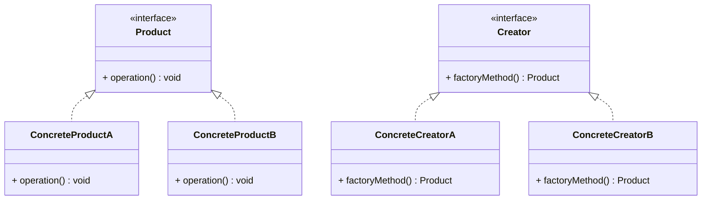
```mermaid
classDiagram
    class Product {
        <<interface>>
        + operation() void
    }

    class ConcreteProductA {
        + operation() void
    }

    class ConcreteProductB {
        + operation() void
    }

    class Creator {
        <<interface>>
        + factoryMethod() Product
    }

    class ConcreteCreatorA {
        + factoryMethod() Product
    }

    class ConcreteCreatorB {
        + factoryMethod() Product
    }

    Product <|.. ConcreteProductA
    Product <|.. ConcreteProductB
    Creator <|.. ConcreteCreatorA
    Creator <|.. ConcreteCreatorB

```

---

### C. Abstract Factory Pattern 🏗️

Provides an interface to create **families of related objects** without specifying their concrete classes. Think of it as a "Factory of Factories."

**Example Scenario:**

* **Indian Payment Family:** UPI + Cash
* **International Payment Family:** Card + Cheque

```java
// Abstract Product Interfaces
interface OnlinePaymentType {
    void pay();
}

interface OfflinePaymentType {
    void pay();
}

// Abstract Factory Interface
interface PaymentTypeFactory {
    OnlinePaymentType getOnlinePaymentMethod();
    OfflinePaymentType getOfflinePaymentMethod();
}

// Concrete Factory 1 - Indian Payment Family
class IndianPaymentFactory implements PaymentTypeFactory {
    @Override
    public OnlinePaymentType getOnlinePaymentMethod() {
        return new UPI();
    }

    @Override
    public OfflinePaymentType getOfflinePaymentMethod() {
        return new Cash();
    }
}

// Concrete Factory 2 - International Payment Family
class InternationalPaymentFactory implements PaymentTypeFactory {
    @Override
    public OnlinePaymentType getOnlinePaymentMethod() {
        return new Card();
    }

    @Override
    public OfflinePaymentType getOfflinePaymentMethod() {
        return new Cheque();
    }
}

// Usage
public class TestFactory {
    public static void main(String[] args) {
        // Indian Payment Family
        PaymentTypeFactory indianPaymentFactory = new IndianPaymentFactory();
        OnlinePaymentType upi = indianPaymentFactory.getOnlinePaymentMethod();
        upi.pay();
        OfflinePaymentType cash = indianPaymentFactory.getOfflinePaymentMethod();
        cash.pay();

        // International Payment Family
        PaymentTypeFactory internationalPaymentFactory = new InternationalPaymentFactory();
        OnlinePaymentType card = internationalPaymentFactory.getOnlinePaymentMethod();
        card.pay();
        OfflinePaymentType cheque = internationalPaymentFactory.getOfflinePaymentMethod();
        cheque.pay();
    }
}
```

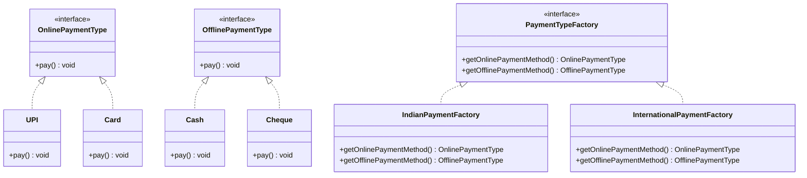
```mermaid
classDiagram
    class OnlinePaymentType {
        <<interface>>
        +pay() void
    }
    
    class OfflinePaymentType {
        <<interface>>
        +pay() void
    }
    
    class UPI {
        +pay() void
    }
    
    class Card {
        +pay() void
    }
    
    class Cash {
        +pay() void
    }
    
    class Cheque {
        +pay() void
    }

    class PaymentTypeFactory {
        <<interface>>
        +getOnlinePaymentMethod() OnlinePaymentType
        +getOfflinePaymentMethod() OfflinePaymentType
    }

    class IndianPaymentFactory {
        +getOnlinePaymentMethod() OnlinePaymentType
        +getOfflinePaymentMethod() OfflinePaymentType
    }

    class InternationalPaymentFactory {
        +getOnlinePaymentMethod() OnlinePaymentType
        +getOfflinePaymentMethod() OfflinePaymentType
    }

    OnlinePaymentType <|.. UPI
    OnlinePaymentType <|.. Card
    OfflinePaymentType <|.. Cash
    OfflinePaymentType <|.. Cheque
    
    PaymentTypeFactory <|.. IndianPaymentFactory
    PaymentTypeFactory <|.. InternationalPaymentFactory

```

**Standard Class Diagram:**

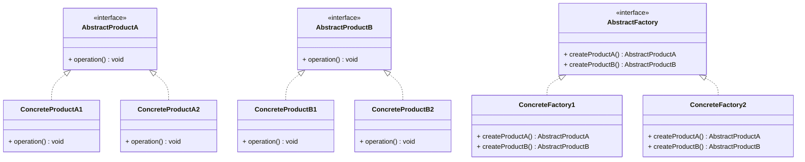
```mermaid
classDiagram
    %% Abstract Products
    class AbstractProductA {
        <<interface>>
        + operation() void
    }

    class AbstractProductB {
        <<interface>>
        + operation() void
    }

    %% Concrete Products Family 1
    class ConcreteProductA1 {
        + operation() void
    }

    class ConcreteProductB1 {
        + operation() void
    }

    %% Concrete Products Family 2
    class ConcreteProductA2 {
        + operation() void
    }

    class ConcreteProductB2 {
        + operation() void
    }

    %% Abstract Factory
    class AbstractFactory {
        <<interface>>
        + createProductA() AbstractProductA
        + createProductB() AbstractProductB
    }

    %% Concrete Factories
    class ConcreteFactory1 {
        + createProductA() AbstractProductA
        + createProductB() AbstractProductB
    }

    class ConcreteFactory2 {
        + createProductA() AbstractProductA
        + createProductB() AbstractProductB
    }

    %% Product Implementations
    AbstractProductA <|.. ConcreteProductA1
    AbstractProductA <|.. ConcreteProductA2
    AbstractProductB <|.. ConcreteProductB1
    AbstractProductB <|.. ConcreteProductB2
    
    %% Factory Implementations
    AbstractFactory <|.. ConcreteFactory1
    AbstractFactory <|.. ConcreteFactory2

```

---

## 📝 Comparison Table

| Feature | Simple Factory | Factory Method | Abstract Factory |
| --- | --- | --- | --- |
| **Complexity** | Low | Medium | High |
| **Scalability** | Hard (modifies code) | Better (adds classes) | Best (adds families) |
| **Focus** | One class for all | Subclasses decide | Families of objects |
| **Principles** | Violates OCP | Follows OCP | Follows OCP & SRP |

---

## 💡 Important Notes from Study

* 🔄 **Composition over Inheritance:** In the Abstract Factory, the `PaymentClient` uses composition to hold a reference to the factory interface.
* 🌐 **Runtime Decision:** The client decides which concrete factory (Indian or International) to use at runtime, making the system highly flexible.


---

<a id="#3-singleton-design-pattern"></a> 
# 3. 🔒 Singleton Design Pattern: 
Notes: 
<p align="center">
  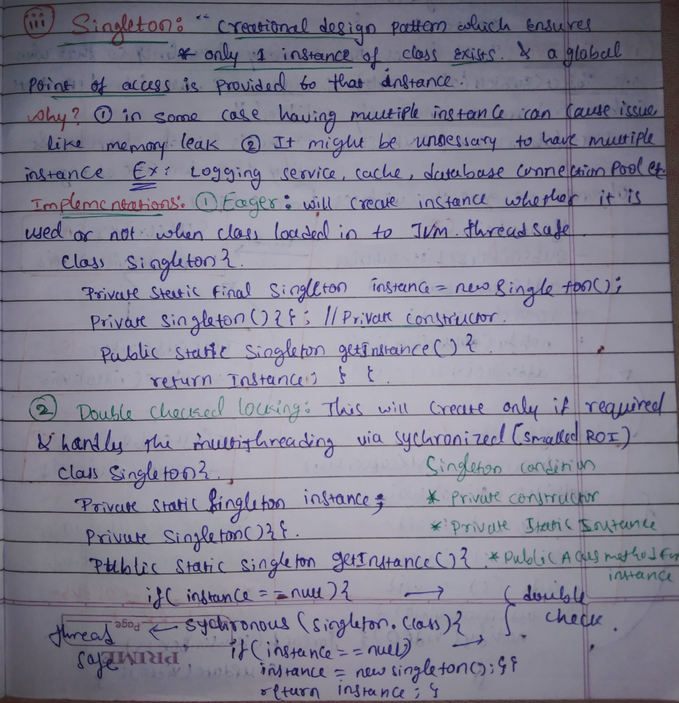</img><br>
  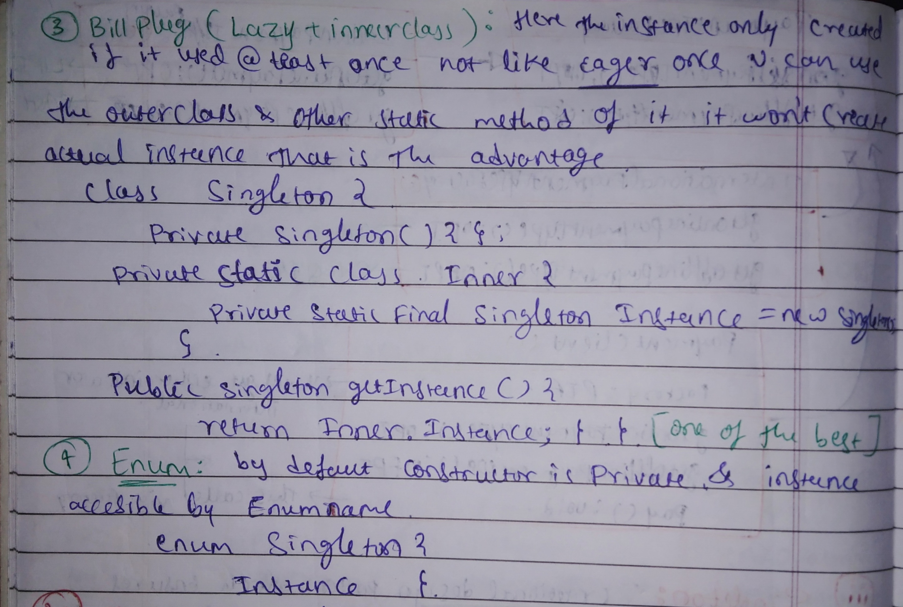</img>
</p>
    
**Singleton Design Pattern**, a foundational Creational pattern in Low-Level Design (LLD). It ensures a class has only one instance and provides a global point of access to it.

---

## 🧩 Overview: What is Singleton?

The **Singleton Pattern** is used to restrict the instantiation of a class to one single "instance." This is particularly useful when exactly one object is needed to coordinate actions across the system.

### ❓ Why use Singleton?

1. **Resource Management:** Multiple instances can cause issues like memory leaks.
2. **Consistency:** Avoids conflicting states in shared resources.
3. **Common Examples:** 
   * 📝 Logging Services
   * ⚡ Cache implementations
   * 🗄️ Database Connection Pools


## 🛡️ The Singleton "Checklist"

To implement a standard Singleton, ensure you have:

1. ✅ **Private Constructor:** Prevents instantiation from other classes.
2. ✅ **Private Static Instance:** Holds the single instance of the class.
3. ✅ **Public Access Method:** Usually named `getInstance()`, providing the global entry point.


---

## 🏗️ Common Implementations

### ① Eager Initialization

The instance is created as soon as the class is loaded into the JVM.

* **Pros:** Thread-safe by default.
* **Cons:** Instance is created even if the application never uses it (waste of resources).

```java
public class EagerSingleton {
    private static final EagerSingleton INSTANCE = new EagerSingleton();

    private EagerSingleton() {}

    public static EagerSingleton getInstance() {
        return INSTANCE;
    }
}

```

---

### ② Double-Checked Locking (Thread-Safe Lazy)

Creates the instance only when required (Lazy) and handles multi-threading efficiently using `synchronized` blocks with a smaller scope.

```java
public class LazySingleton {
    private static LazySingleton INSTANCE;

    private LazySingleton() {}

    public static LazySingleton getInstance() {
        if (INSTANCE == null) {
            synchronized (LazySingleton.class) {
                if (INSTANCE == null) {
                    INSTANCE = new LazySingleton();
                }
            }
        }
        return INSTANCE;
    }
}

```

---

### ③ Bill Pugh Singleton (Inner Class)

The most recommended approach for most Java versions. It uses a static inner helper class. The instance is only created when `getInstance()` is called, making it **Lazy** and **Thread-Safe** without explicit synchronization.

```java
public class LazyInnerClassSingleton {
    private LazyInnerClassSingleton() {}

    private static class LazyInner {
        private static final LazyInnerClassSingleton INSTANCE = new LazyInnerClassSingleton();
    }

    public static LazyInnerClassSingleton getInstance() {
        return LazyInner.INSTANCE;
    }
}
```

---

### ④ Enum Singleton

Considered the **best implementation** in many scenarios because Java guarantees that any `enum` value is instantiated only once. It provides built-in protection against Reflection and Serialization attacks.

```java
public enum SingletonEnum {
    INSTANCE
}

```

---
## ⚖️ Comparison of Approaches

| Method | Thread-Safe? | Lazy Loading? | Recommended? |
| --- | --- | --- | --- |
| **Eager** | ✅ Yes | ❌ No | ⚠️ Minimal |
| **Double-Checked** | ✅ Yes | ✅ Yes | ✅ Yes |
| **Bill Pugh** | ✅ Yes | ✅ Yes | 🌟 High |
| **Enum** | ✅ Yes | ❌ No | 🏆 Best |

---

<a id="-4-observer-design-pattern"></a>
# 4. 📡 Observer Design Pattern: 

Notes:

<p align="center">
  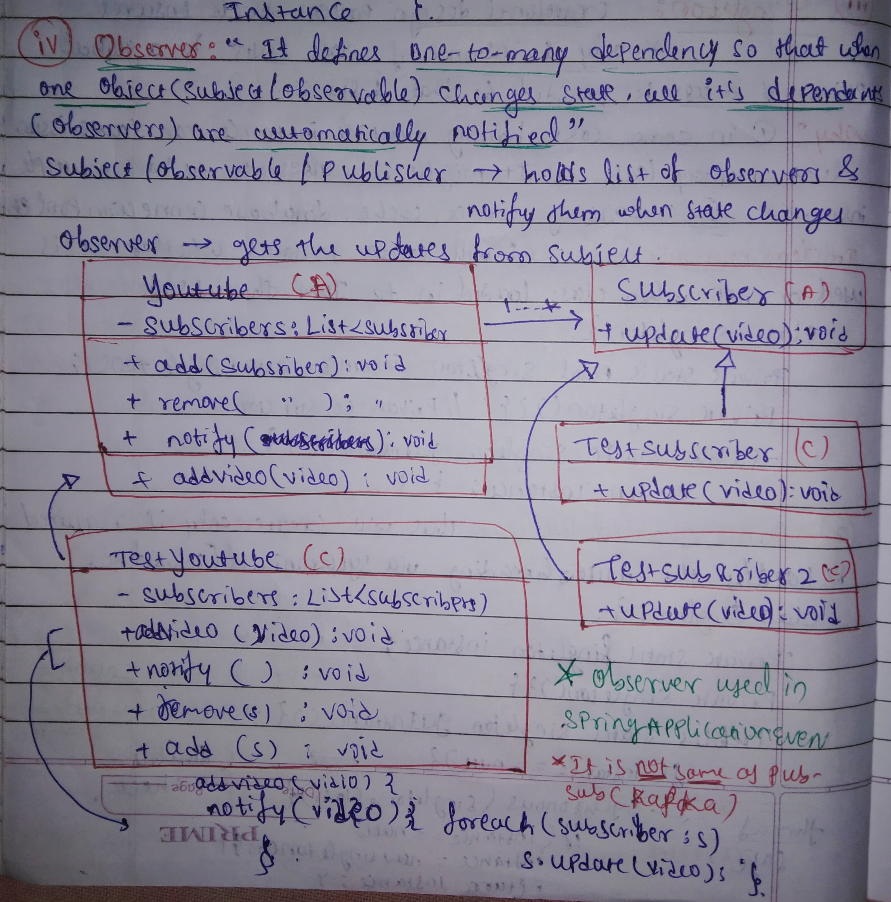</img>
</p>
    
**Observer Pattern** focusing on how objects communicate efficiently in a decoupled manner.

The **Observer Pattern** defines a **one-to-many dependency** between objects. When one object (the **Subject**) changes state, all its dependents (**Observers**) are notified and updated automatically.

### 🏗️ Core Components

1. **Subject (Observable/Publisher):** Holds a list of observers and notifies them of state changes.
2. **Observer (Subscriber):** Gets updates from the Subject whenever a change occurs.

### 📺 Real-World Example: YouTube Notification System

Here is how a YouTube subscription model implements this pattern:

```java
// Observer Interface
interface ISubscriber {
    void update(String video);
}

// Subject Interface
interface IYoutubeChannel {
    void subscribe(ISubscriber subscriber);
    void unSubscribe(ISubscriber subscriber);
    void addVideo(String video);
}

// Concrete Subject
class CoderArmyChannel implements IYoutubeChannel {
    private List<ISubscriber> subscriberList = new ArrayList<>();

    @Override
    public void subscribe(ISubscriber subscriber) {
        subscriberList.add(subscriber);
    }

    @Override
    public void unSubscribe(ISubscriber subscriber) {
        subscriberList.remove(subscriber);
    }

    @Override
    public void addVideo(String video) {
        notifySubscribers(video);
    }

    private void notifySubscribers(String video) {
        for (ISubscriber s : subscriberList) {
            s.update(video);
        }
    }
}

// Concrete Observer
class Subscriber implements ISubscriber {
    private String name;

    public Subscriber(String name) {
        this.name = name;
    }

    @Override
    public void update(String video) {
        System.out.println("Hey " + name + " new video: " + video);
    }
}

// Usage
public class TestObserver {
    public static void main(String[] args) {
        IYoutubeChannel channel = new CoderArmyChannel();
        ISubscriber sid = new Subscriber("Sid");
        ISubscriber raj = new Subscriber("Raj");

        channel.subscribe(sid);
        channel.subscribe(raj);
        channel.addVideo("Observer Design Pattern");

        channel.unSubscribe(raj);
        channel.addVideo("Decorator Design Pattern");
    }
}
```

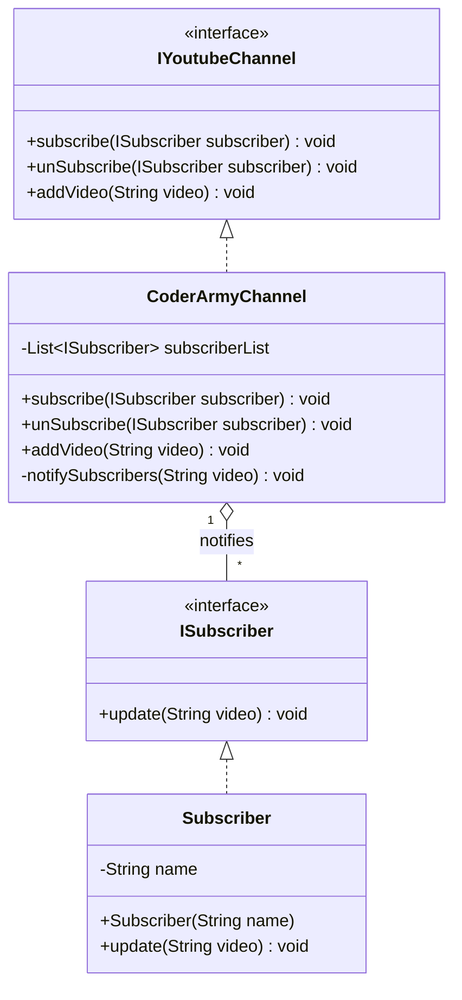
```mermaid
classDiagram
    class IYoutubeChannel {
        <<interface>>
        +subscribe(ISubscriber subscriber) void
        +unSubscribe(ISubscriber subscriber) void
        +addVideo(String video) void
    }

    class ISubscriber {
        <<interface>>
        +update(String video) void
    }

    class CoderArmyChannel {
        -List~ISubscriber~ subscriberList
        +subscribe(ISubscriber subscriber) void
        +unSubscribe(ISubscriber subscriber) void
        +addVideo(String video) void
        -notifySubscribers(String video) void
    }

    class Subscriber {
        -String name
        +Subscriber(String name)
        +update(String video) void
    }

    IYoutubeChannel <|.. CoderArmyChannel
    ISubscriber <|.. Subscriber
    CoderArmyChannel "1" o-- "*" ISubscriber : notifies

```

### Standard class diagram 

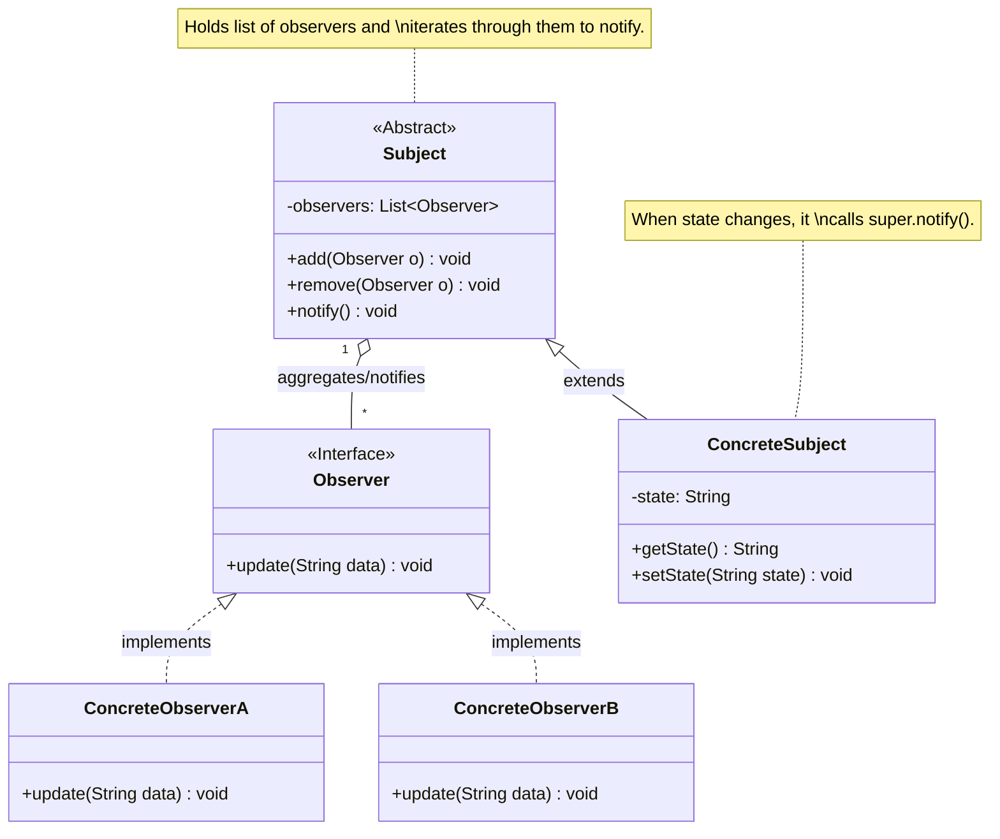
```mermaid
classDiagram
    class Subject {
        <<Abstract>>
        -observers: List~Observer~
        +add(Observer o) void
        +remove(Observer o) void
        +notify() void
    }

    class Observer {
        <<Interface>>
        +update(String data) void
    }

    class ConcreteSubject {
        -state: String
        +getState() String
        +setState(String state) void
    }

    class ConcreteObserverA {
        +update(String data) void
    }

    class ConcreteObserverB {
        +update(String data) void
    }

    Subject "1" o-- "*" Observer : aggregates/notifies
    Subject <|-- ConcreteSubject : extends
    Observer <|.. ConcreteObserverA : implements
    Observer <|.. ConcreteObserverB : implements

    note for Subject "Holds list of observers and \niterates through them to notify."
    note for ConcreteSubject "When state changes, it \ncalls super.notify()."
```

---

## 🚀 Key Takeaways & Pro-Tips

* 🔔 **Automatic Updates:** Observers don't need to "poll" for data; they are "pushed" updates.
* 🔗 **Loose Coupling:** The Subject doesn't need to know the concrete class of the Observer, only that it implements the `update()` method.
* 🍃 **Spring Framework:** This pattern is the foundation of `SpringApplicationEvent`.
* ⚠️ **Note on Pub-Sub:**  **Observer is NOT exactly the same as Pub-Sub** (like Kafka). In Observer, the Subject knows its observers, while in Pub-Sub, they are separated by a Message Broker/Bus.
* **Thread Safety:** In a multi-threaded environment, notify logic should be handled carefully to avoid `ConcurrentModificationException` if a subscriber tries to unregister while a notification is in progress.

---

<a id="-5-decorator-design-pattern"></a>
# 5. ☕ Decorator Design Pattern: 

Notes:

<p align="center">
  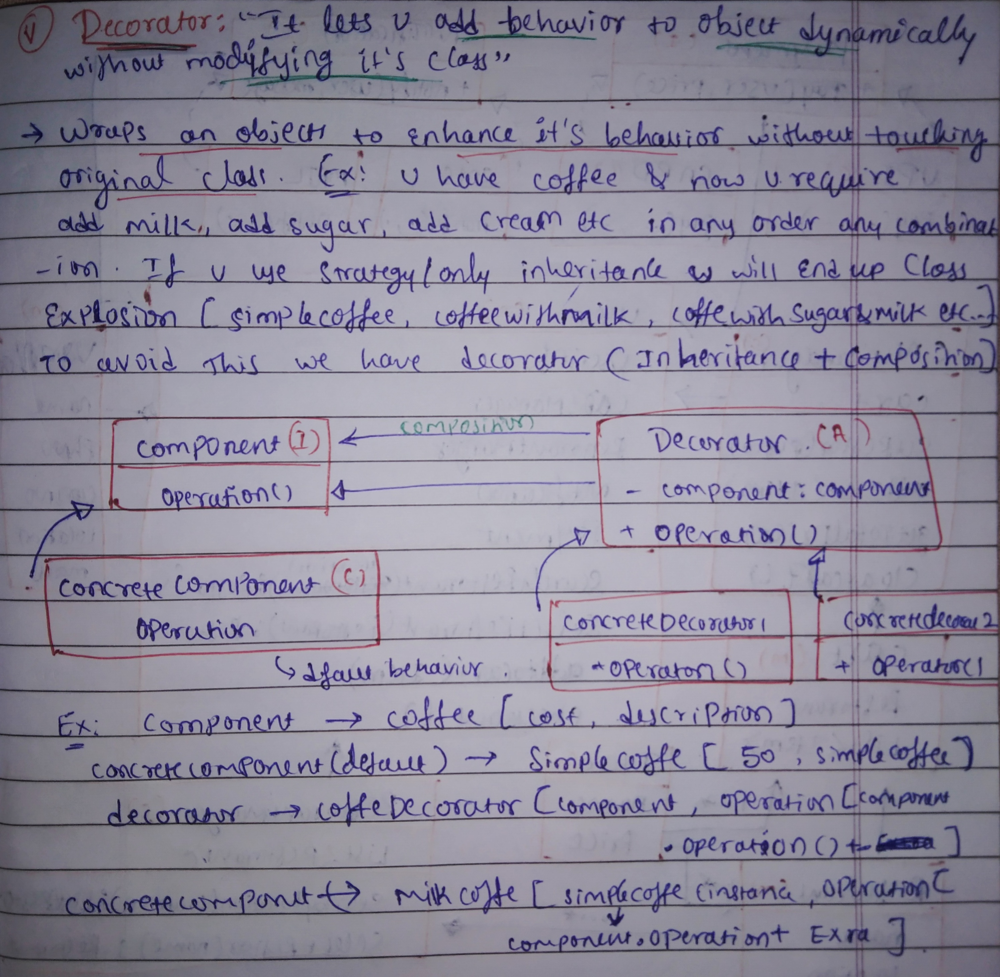</img>
</p>
    
**Decorator Pattern** This is a core **Structural Design Pattern** that focuses on adding responsibilities to objects dynamically and transparently.

---

## 🧩 Concept Overview

The **Decorator Pattern** lets you attach new behaviors to objects by placing these objects inside special wrapper objects that contain the behaviors.

### ✨ Why use it?

* 🚀 **Dynamic Behavior:** Add or remove responsibilities at runtime.
* 🛡️ **Avoid "Class Explosion":** Instead of creating 50 subclasses for every possible combination of features (e.g., `CoffeeWithMilk`, `CoffeeWithSugar`, `CoffeeWithMilkAndSugar`), you create small, reusable decorators.
* 🔗 **Inheritance + Composition:** It uses a mix of both to achieve high flexibility without touching the original class code.

> **Key Rule:** Decorator follows the **Open-Closed Principle**—classes should be open for extension but closed for modification.

---

## 🏗️ Structure & Implementation

The pattern consists of a **Component**, a **Concrete Component**, a **Base Decorator**, and **Concrete Decorators**.

### 📊 Class Diagram Based on Coffee Shop Example

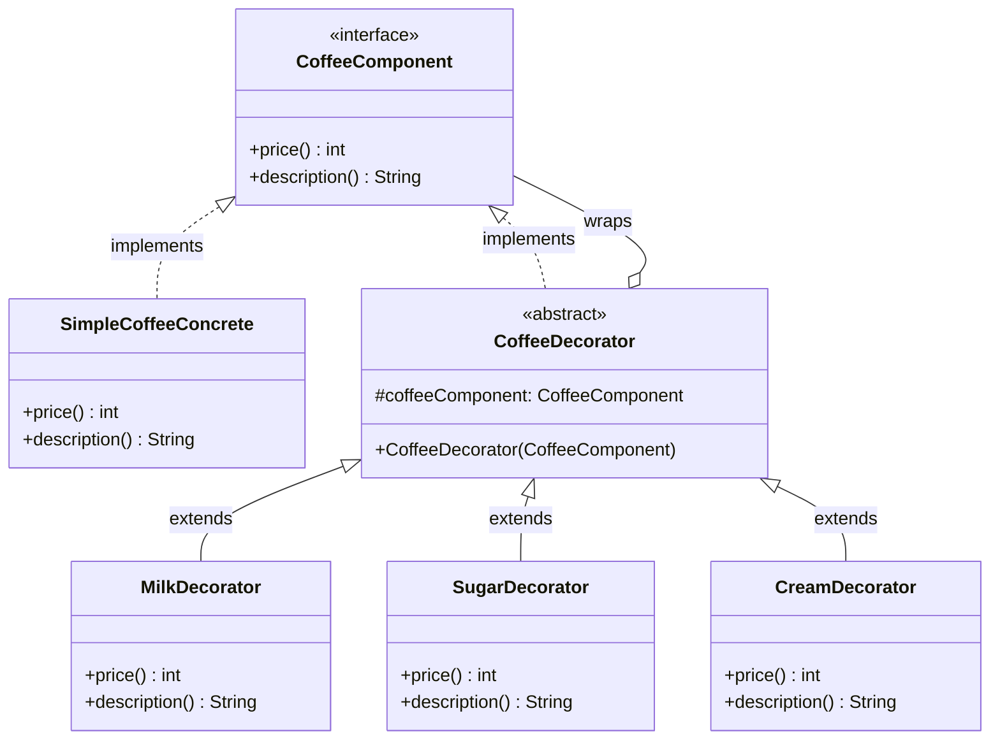
```mermaid
classDiagram
    class CoffeeComponent {
        <<interface>>
        +price() int
        +description() String
    }

    class SimpleCoffeeConcrete {
        +price() int
        +description() String
    }

    class CoffeeDecorator {
        <<abstract>>
        #coffeeComponent: CoffeeComponent
        +CoffeeDecorator(CoffeeComponent)
    }

    class MilkDecorator {
        +price() int
        +description() String
    }

    class SugarDecorator {
        +price() int
        +description() String
    }

    class CreamDecorator {
        +price() int
        +description() String
    }

    CoffeeComponent <|.. SimpleCoffeeConcrete : implements
    CoffeeComponent <|.. CoffeeDecorator : implements
    CoffeeDecorator <|-- MilkDecorator : extends
    CoffeeDecorator <|-- SugarDecorator : extends
    CoffeeDecorator <|-- CreamDecorator : extends
    CoffeeDecorator o-- CoffeeComponent : wraps

```

### 📊 Standard Class Diagram (Mermaid)

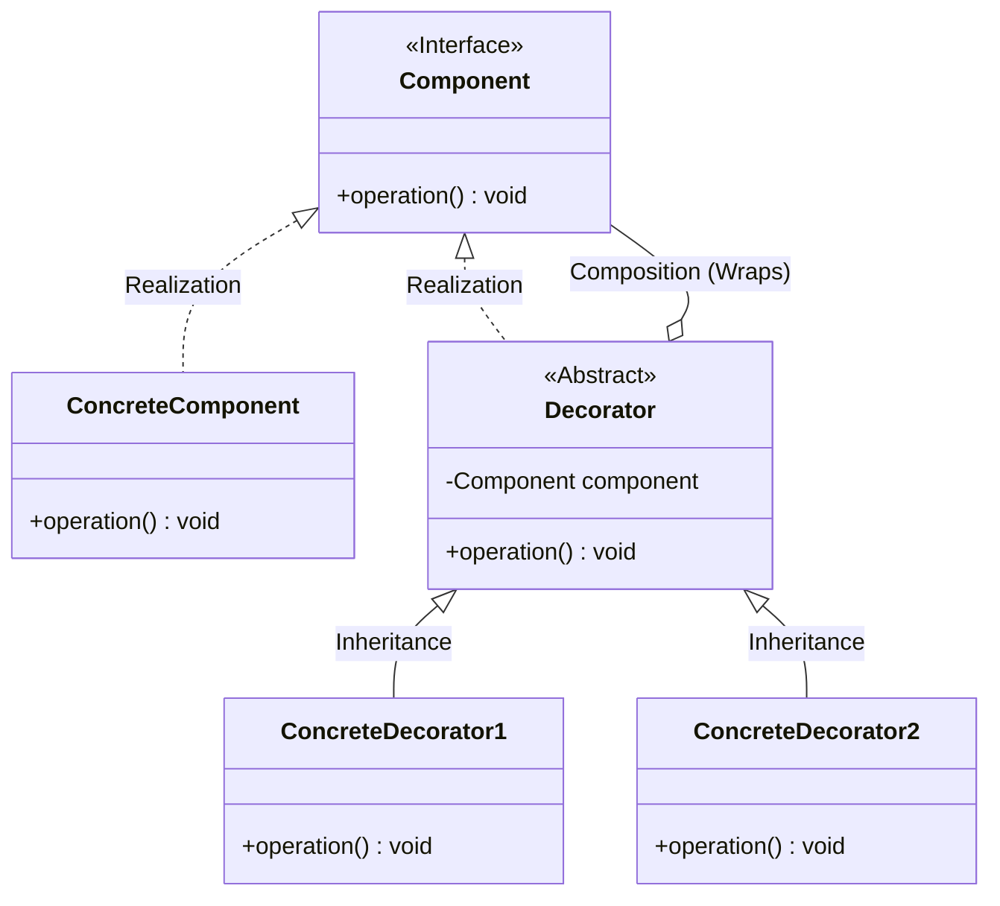
```mermaid
classDiagram
    class Component {
        <<Interface>>
        +operation() void
    }
    class ConcreteComponent {
        +operation() void
    }
    class Decorator {
        <<Abstract>>
        -Component component
        +operation() void
    }
    class ConcreteDecorator1 {
        +operation() void
    }
    class ConcreteDecorator2 {
        +operation() void
    }

    Component <|.. ConcreteComponent : Realization
    Component <|.. Decorator : Realization
    Decorator o-- Component : Composition (Wraps)
    Decorator <|-- ConcreteDecorator1 : Inheritance
    Decorator <|-- ConcreteDecorator2 : Inheritance

```
### Example

```java
// Component Interface
interface CoffeeComponent {
    int price();
    String description();
}

// Concrete Component
class SimpleCoffeeConcrete implements CoffeeComponent {
    @Override
    public int price() {
        return 50;
    }

    @Override
    public String description() {
        return "Simple coffee";
    }
}

// Abstract Decorator
abstract class CoffeeDecorator implements CoffeeComponent {
    protected final CoffeeComponent coffeeComponent;

    protected CoffeeDecorator(CoffeeComponent coffeeComponent) {
        this.coffeeComponent = coffeeComponent;
    }
}

// Concrete Decorators
class MilkDecorator extends CoffeeDecorator {
    public MilkDecorator(CoffeeComponent coffeeComponent) {
        super(coffeeComponent);
    }

    @Override
    public int price() {
        return coffeeComponent.price() + 10;
    }

    @Override
    public String description() {
        return coffeeComponent.description() + " with Milk";
    }
}

class SugarDecorator extends CoffeeDecorator {
    public SugarDecorator(CoffeeComponent coffeeComponent) {
        super(coffeeComponent);
    }

    @Override
    public int price() {
        return coffeeComponent.price() + 5;
    }

    @Override
    public String description() {
        return coffeeComponent.description() + " with Sugar";
    }
}

// Usage
public class TestDecorator {
    public static void main(String[] args) {
        // Simple coffee
        CoffeeComponent coffee = new SimpleCoffeeConcrete();
        System.out.println(coffee.description() + ": " + coffee.price());

        // Coffee with Milk
        CoffeeComponent milkCoffee = new MilkDecorator(coffee);
        System.out.println(milkCoffee.description() + ": " + milkCoffee.price());

        // Coffee with Sugar + Milk (Chained decorators)
        CoffeeComponent sugarMilkCoffee = new MilkDecorator(new SugarDecorator(coffee));
        System.out.println(sugarMilkCoffee.description() + ": " + sugarMilkCoffee.price());
    }
}
```
---

## ☕ The "Coffee Shop" Example

Imagine you have a basic coffee and want to add toppings like Milk, Sugar, or Cream.

### ❌ The Problem: Class Explosion

If you use only inheritance:

* `SimpleCoffee`
* `MilkCoffee`
* `SugarCoffee`
* `MilkAndSugarCoffee`... (The list grows exponentially!)

### ✅ The Solution: Decorator Pattern

You wrap the `SimpleCoffee` object with a `MilkDecorator`, then wrap that with a `SugarDecorator`.

**How it works internally:**

1. `ConcreteComponent` (SimpleCoffee) returns the base cost: **50**.
2. `MilkDecorator` calls the inner component's `cost()` and adds its own: **50 + 10 = 60**.
3. `SugarDecorator` calls the milk coffee's `cost()`: **60 + 5 = 65**.

---

## 🚀 Pro-Tips & Extra Info

### 🛠️ Important Additions:

* **Order Matters:** Because decorators are wrappers, the order in which you wrap them can change the behavior (e.g., applying a "Discount Decorator" before or after a "Tax Decorator").
* **Java I/O:** The most famous real-world use of this pattern is in **Java I/O Classes**.
* `BufferedInputStream(FileInputStream(File))` is a classic decorator chain!


* **Comparison with Strategy:** * **Strategy** changes the *guts* (the internal algorithm) of the object.
* **Decorator** changes the *skin* (the external behavior/wrapping) of the object.


---
