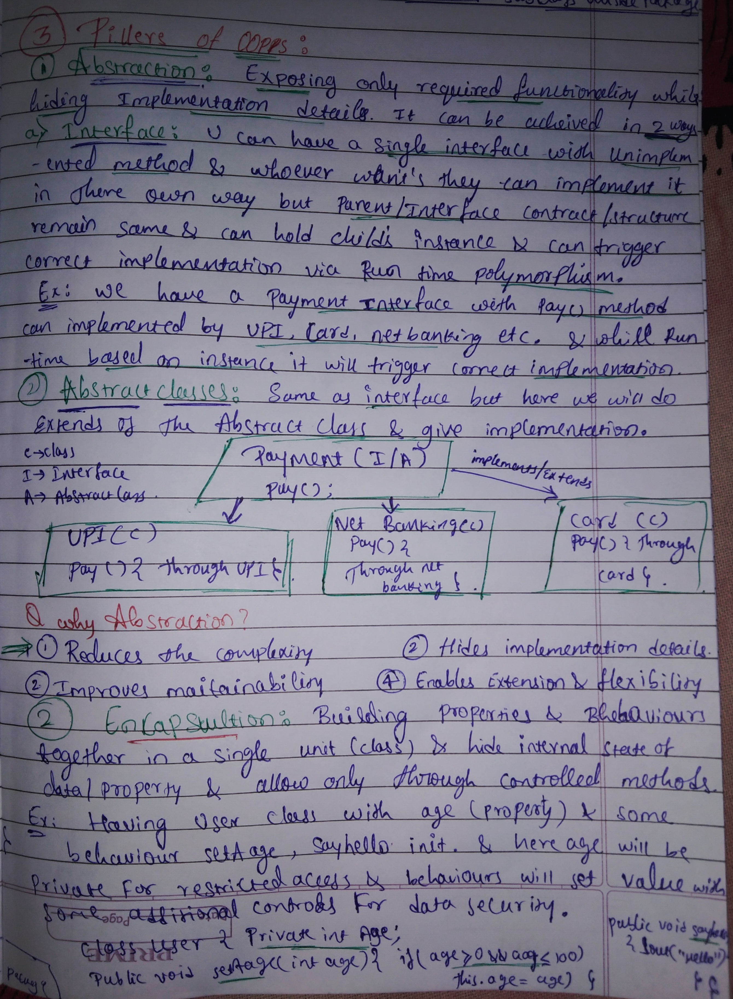
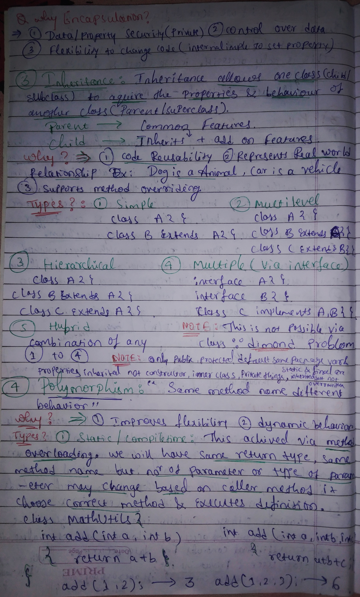
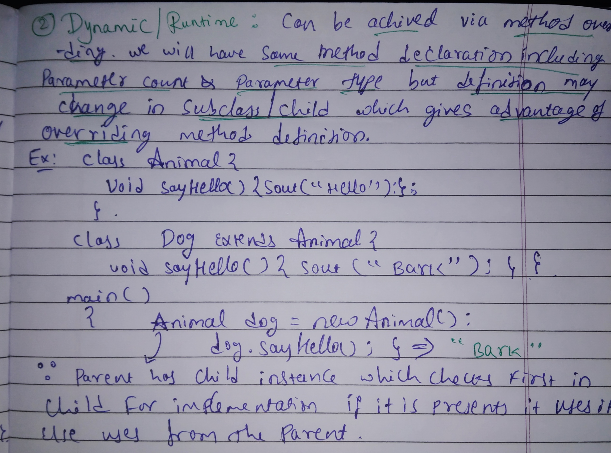
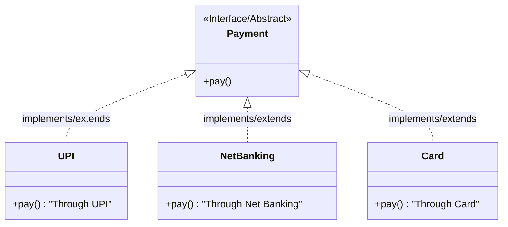

# 🏛️ Pillars of OOPs

Notes: 

<p align="center">
  </img><br>
  </img><br>
  </img>
</p>

---

## 1️⃣ Abstraction
**Definition:** Exposing only required functionality while hiding implementation details. It can be achieved in two ways:

* **A) Interface:** You can have a single interface with unimplemented methods. Whoever wants them can implement them in their own way, but the parent/interface contract remains the same. It can hold a child's instance and trigger the correct implementation via **Run-time Polymorphism**.
    * *Example:* A `Payment` interface with a `pay()` method can be implemented by UPI, Card, NetBanking, etc.
* **B) Abstract Classes:** Same as an interface, but here we use `extends` for the Abstract Class and provide implementation.

> [!TIP]
> Interface methods are **public by default**. Abstract classes can also have **concrete (non-abstract) methods** — something interfaces couldn't do before Java 8.

### 🔷 A) Via Interface

```java
// IPayment.java
public interface IPayment {
    void pay(); // public by default
}

// UPI.java
public class UPI implements IPayment {
    @Override
    public void pay() {
        log.info("Paying through UPI via interface abstraction...");
    }
}

// Card.java
public class Card implements IPayment {
    @Override
    public void pay() {
        log.info("Paying through credit card via interface abstraction...");
    }
}

// NetBanking.java
public class NetBanking implements IPayment {
    @Override
    public void pay() {
        log.info("Paying through net banking via interface abstraction...");
    }
}

// Test - Runtime polymorphism in action
IPayment upi = new UPI();
upi.pay(); // → "Paying through UPI via interface abstraction..."

IPayment card = new Card();
card.pay(); // → "Paying through credit card via interface abstraction..."
```

### 🔶 B) Via Abstract Class

```java
// APayment.java
public abstract class APayment {
    abstract void pay(); // must be implemented by subclass

    public void simpleNonAbstractMethod() {
        log.info("Hey I am simple non abstract method"); // concrete method — only in abstract classes!
    }
}

// UPI.java
public class UPI extends APayment {
    @Override
    public void pay() {
        log.info("Paying through UPI via abstract class abstraction...");
    }
}

// Test - Abstract class holding child instances via runtime polymorphism
APayment upi = new UPI();
upi.pay(); // → "Paying through UPI via abstract class abstraction..."

APayment netBanking = new NetBanking();
netBanking.pay(); // → "Paying through net banking via abstract class abstraction..."
```

### 🆚 Interface vs Abstract Class

| Feature | Interface | Abstract Class |
|---|---|---|
| Methods | Only abstract (pre Java 8) | Abstract + Concrete |
| Inheritance | `implements` (multiple allowed) | `extends` (single only) |
| Variables | `public static final` by default | Any type |
| Use when | Defining a contract | Sharing common base logic |

### 📊 Abstraction Data Flow


### ❓ Why Abstraction?
1. Reduces complexity.
2. Improves maintainability.
3. Hides implementation details.
4. Enables extension and flexibility.

---

## 2️⃣ Encapsulation
**Definition:** Building properties and behaviors together in a single unit (class) and hiding the internal state of data/properties. Access is allowed only through controlled methods.

* **Example:** A `User` class with `age` (private, controlled) and `publicAge` (public, uncontrolled). The difference is clear — anyone can set an invalid `publicAge`, but `setAge()` guards the private `age`.

```java
// User.java
@ToString
public class User {
    // ❌ Without encapsulation — no control, anyone can set -10
    public int publicAge = 10;

    // ✅ With encapsulation — only setAge() can change it, with validation
    private int age = 10;

    public int getAge() { return age; }

    public void setAge(int age) {
        if (age >= 0 && age <= 100) // 🔒 guard/control
            this.age = age;
    }

    public void sayHello() {
        log.info("Hello from user");
    }
}
```

```java
// TestEnCapsulation.java — demonstrating the difference
User user = new User();

user.publicAge = -10;       // ⚠️ No control! Sets invalid age directly
user.setAge(-10);           // ✅ Ignored — validation fails, age stays 10
// user.age = -10;          // ❌ Compile error — private field not accessible

log.info("User info {}", user); // Uses @ToString from Lombok
user.sayHello();
```


### ❓ Why Encapsulation?
1. 🔒 Data/Property Security (Private).
2. 🎛️ Control over data.
3. 🔧 Flexibility to change internal implementation without affecting callers.

---

## 3️⃣ Inheritance
**Definition:** Inheritance allows one class (Child/Subclass) to acquire the properties and behaviors of another class (Parent/Superclass).

* **Parent** → Common Features
* **Child** → Inherits + Add-on Features

### 📋 What Gets Inherited?

From the `Inheritance.java` file:

```java
class Parent {
    // ✅ Inherited
    public String name = "Siddu";
    static int age = 24;
    final int score = 29;
    public void sayHello() { ... }
    public static void inheritableStaticMethod() { ... }  // inherited, NOT overridable
    public final void inheritableFinalMethod() { ... }    // inherited, NOT overridable

    // ❌ NOT inherited
    private int nonInheritablePrivateVar = 12345;
    private void nonInheritablePrivateMethod() { ... }
    // Constructor is also NOT inherited (but can be called via super())
}

class Child extends Parent {
    public Child() {
        super(); // 👆 calling parent constructor explicitly
    }

    public void thingsFromParentInherited() {
        age = 40;               // ✅ static var — modifies shared parent state
        // score = 100;         // ❌ final — cannot reassign
        inheritableStaticMethod();  // ✅ inherited
        inheritableFinalMethod();   // ✅ inherited
    }

    @Override
    public void sayHello() {
        super.sayHello(); // calling parent's version before adding own logic
    }
}
```

### 📂 Types of Inheritance

#### 1️⃣ Simple Inheritance — `SimpleInheritance.java`
Class `Child` extends `Parent`. Child inherits `surName()` directly.
```java
class Parent {
    public void surName() { log.info("surname is pattanashetti"); }
}

class Child extends Parent {
    // surName() inherited automatically ✅
}

// Usage
Child child = new Child(); // prints: "Parent constructor" then "Child constructor"
child.surName();           // → "surname is pattanashetti"
```
> 💡 When a child object is created, the **parent constructor runs first**, then the child constructor!

---

#### 2️⃣ Multilevel Inheritance — `MultiLevelInheritance.java`
`Animal` → `Dog` → `LabDog` — a chain of inheritance.
```java
class Animal {
    public void sayHello() { log.info("Animal Hello!"); }
}

class Dog extends Animal {
    @Override
    public void sayHello() { log.info("Bark Bark"); }
}

class LabDog extends Dog {
    @Override
    public void sayHello() { log.info("Woof Woof"); }
}

// Runtime polymorphism — parent reference, child behavior
Animal lab = new LabDog();
lab.sayHello(); // → "Woof Woof" (most specific implementation wins)
```

---

#### 3️⃣ Hierarchical Inheritance — `Hierarchical.java`
Both `Bike` and `Car` extend `Vehicle`.
```java
class Vehicle {
    public void start() { log.info("vehicle starts..."); }
    public void numberOfTiers() { log.info("Number of tiers in Vehicle varies"); }
}

class Bike extends Vehicle {
    @Override
    public void numberOfTiers() { log.info("number of tiers in bike 2"); }
}

class Car extends Vehicle {
    @Override
    public void numberOfTiers() { log.info("number of tiers in car 4"); }
}

// Both share start() from Vehicle but override numberOfTiers() independently
Vehicle bike = new Bike();
bike.numberOfTiers(); // → "number of tiers in bike 2"

Vehicle car = new Car();
car.numberOfTiers(); // → "number of tiers in car 4"
```

---

#### 4️⃣ Multiple Inheritance (Via Interface) — `MultipleInheritanceViaInterface.java`
`SuperMan` implements both `Man` and `SuperHero` interfaces.
```java
interface Man {
    void manPower();
}

interface SuperHero {
    void superHeroPower();
}

class SuperMan implements Man, SuperHero {
    @Override
    public void manPower() { log.info("Have man power"); }

    @Override
    public void superHeroPower() { log.info("Have superhero powers"); }
}
```
> ⚠️ **Diamond Problem:** Multiple inheritance via **classes** is not allowed in Java. Use **interfaces** instead!

---

#### 5️⃣ Hybrid Inheritance — `HybridInheritance.java`
A combination of Simple + Multiple inheritance. `ExtrOrdinaryMan` extends `Animal` (simple) and implements `Man` & `SuperHero` (multiple via interfaces).
```java
class ExtrOrdinaryMan extends Animal implements Man, SuperHero {
    @Override
    public void manPower() { log.info("This is the hybrid inheritance man (multiple + simple)"); }

    @Override
    public void superHeroPower() { log.info("This is the hybrid inheritance man (multiple + simple)"); }
    // sayHello() is inherited from Animal 🐾
}

ExtrOrdinaryMan hero = new ExtrOrdinaryMan();
hero.manPower();
hero.superHeroPower();
hero.sayHello(); // from Animal
```

### ❓ Why Inheritance?
1. ♻️ Code Reusability.
2. 🌍 Represents Real-world relationships (e.g., *Dog is an Animal*, *Car is a Vehicle*).
3. 🔄 Supports method overriding.

> [!NOTE]
> **Inheritance Rules:** Only `public`, `protected`, and `default` (same package) members are inherited.
> Constructors, `private` members are **not inherited**.
> `static` and `final` members **are inherited but cannot be overridden** (only hidden/shadowed).

---

## 4️⃣ Polymorphism
**Definition:** "Same method name, different behavior."

### ❓ Why Polymorphism?
1. 💪 Improves flexibility.
2. ⚡ Enables dynamic behavior.

---

### 🟢 Type 1: Static / Compile-time Polymorphism — `CompileTimePolyMorphism.java`
Achieved via **Method Overloading**. Same method name, different parameter list. The compiler resolves which method to call at **compile time**.

```java
public class CompileTimePolyMorphism {
    // Same name, 2 params
    public static int add(int a, int b) {
        return a + b;
    }

    // Same name, 3 params — overloaded!
    public static int add(int a, int b, int c) {
        return a + b + c;
    }

    public static void main(String[] args) {
        log.info("add with 2 numbers {}", add(1, 2));    // → 3
        log.info("add with 3 numbers {}", add(1, 2, 3)); // → 6
    }
}
```
> 💡 The compiler sees the **number of arguments** and picks the right `add()` — no ambiguity!

---

### 🔵 Type 2: Dynamic / Runtime Polymorphism — `RunTimePolyMorphism.java`
Achieved via **Method Overriding**. Same method signature, but the child class provides its own implementation. Resolved at **runtime** based on the actual object instance.

```java
class Animal {
    public void SayHello() {
        log.info("Hello from animal!");
    }
}

class Dog extends Animal {
    @Override
    public void SayHello() {
        log.info("Woof Woof"); // 🐶 overrides Animal's version
    }
}

// Parent reference, Child instance → runtime decides which method to call
Animal dog = new Dog();
dog.SayHello(); // → "Woof Woof" (Dog's version, not Animal's!)
```

**Logic:** The JVM checks the **actual instance type** at runtime. If the child has overridden the method, the child's version is called — this is the heart of **dynamic dispatch**.

> [!TIP]
> This pattern (parent reference holding child instance) is the foundation of **Abstraction + Polymorphism** working together. You saw the same pattern in `TestInterfaceImplFunctionality.java` and `TestAbstractClassImplFunctionality.java`!
