# 🚀 SOLID Principles in Low-Level Design (LLD)
Notes:

<p align="center">
  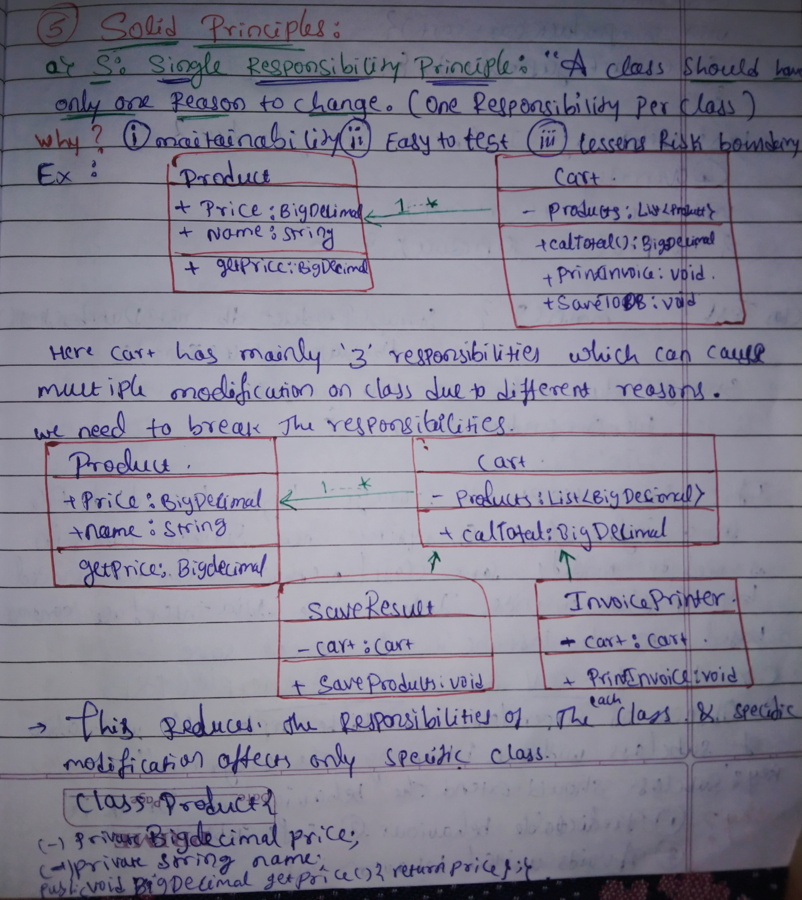</img><br>
  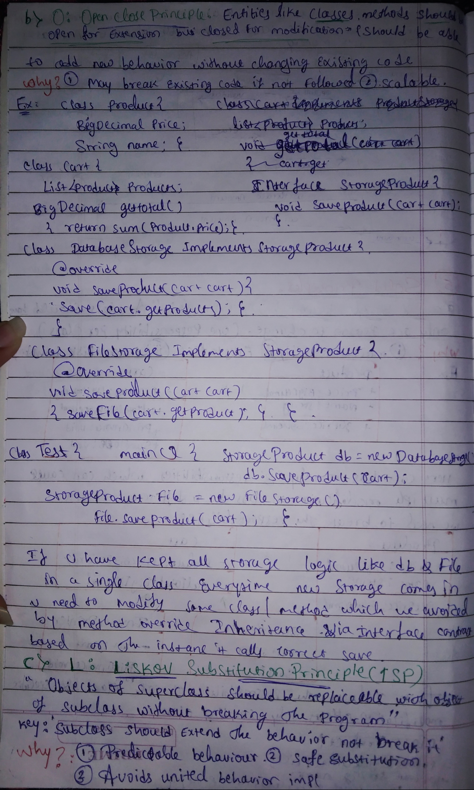</img><br>
  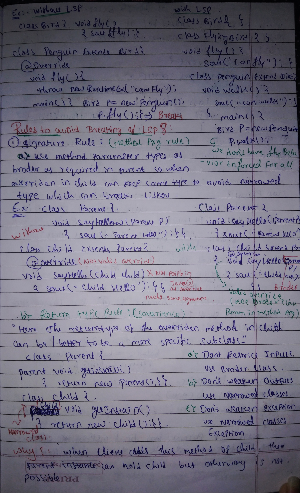</img><br>
  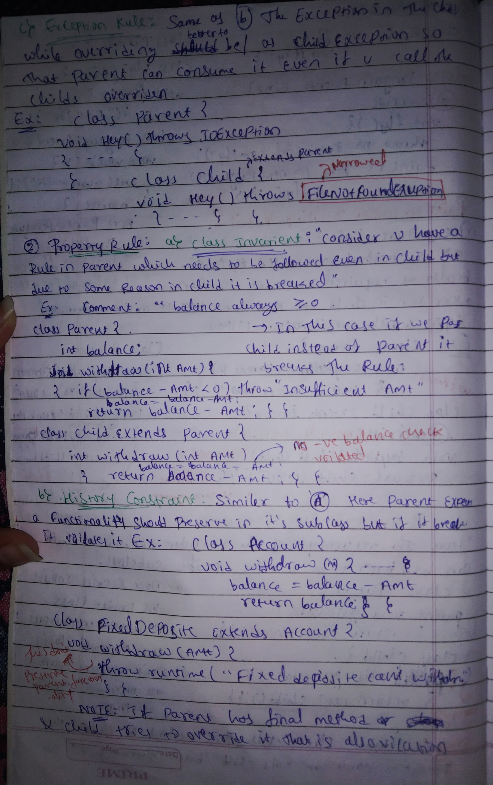</img><br>
  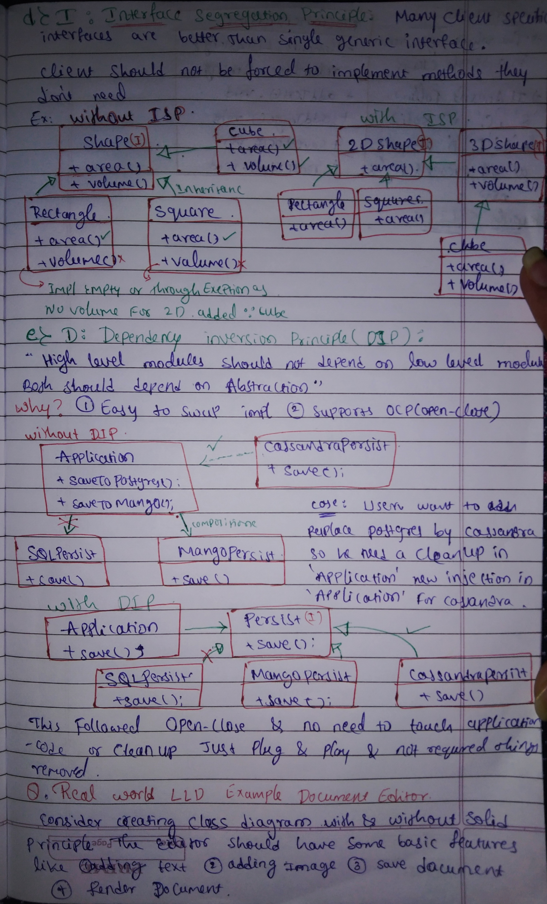</img><br>
  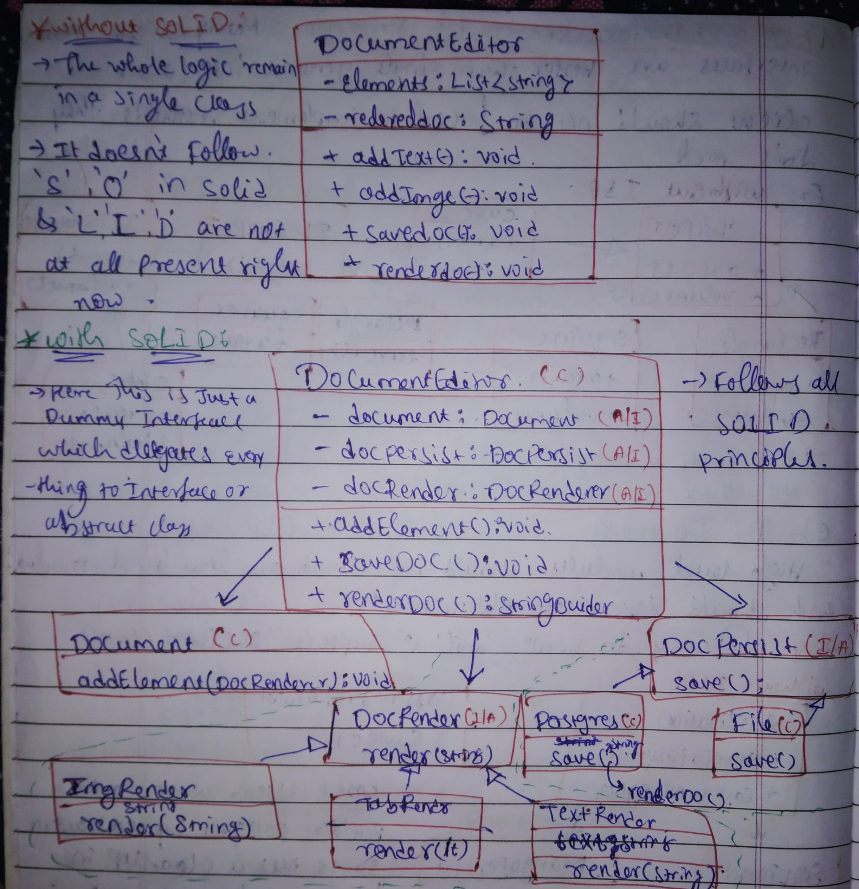</img>
</p>
    

---

## 📌 1. Single Responsibility Principle (SRP)
> **"A class should have only one reason to change."**

### ❌ The Problem
A single `Cart` class handles pricing, invoice printing, and persistence.

### ✅ The Solution
Split responsibilities into focused classes.

### ✂️ Short Example
```java
Cart cart = new Cart(products);

InvoicePrinter printer = new InvoicePrinter(cart);
printer.printInvoice();

ProductStorage storage = new ProductStorage(cart);
storage.saveProductsToDatabase();
```

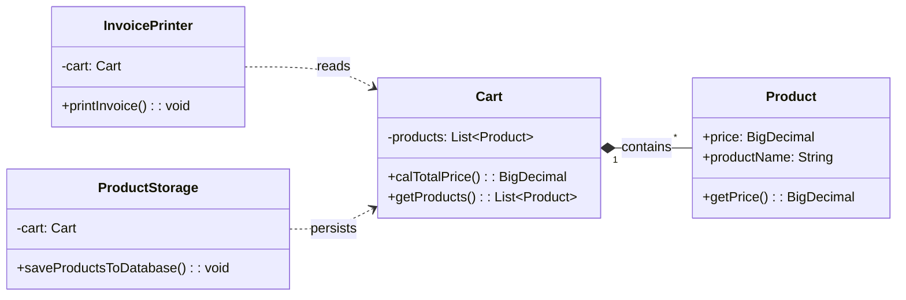

---

## 🛠️ 2. Open-Closed Principle (OCP)
> **"Software entities should be open for extension, but closed for modification."**

### ❌ The Problem
Storage logic grows by adding new methods in the same class.

### ✅ The Solution
Keep one storage contract and add new implementations.

### ✂️ Short Example
```java
ProductStorage postgres = new PostgresProductStorage();
postgres.saveProducts(cart);

ProductStorage mongo = new MongoProductStorage();
mongo.saveProducts(cart);

ProductStorage file = new FileProductStorage();
file.saveProducts(cart);
```

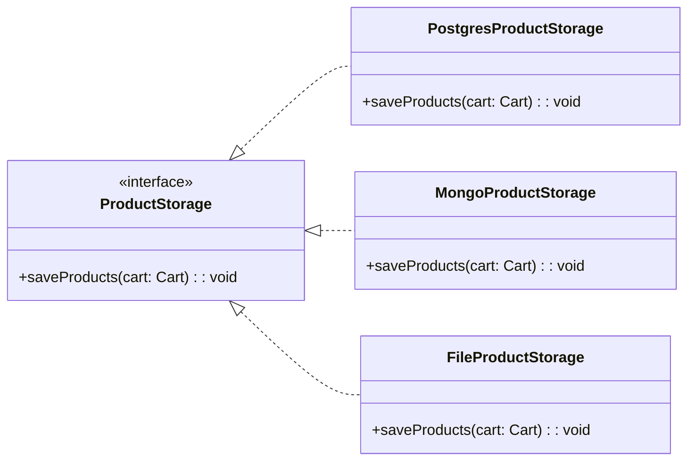

---

## 🦆 3. Liskov Substitution Principle (LSP)
> **"Objects of a superclass should be replaceable with objects of its subclass without breaking the program."**

### ❌ Violation Example
`Penguin` is forced into `fly()` and throws an exception.

### ✅ Corrected Approach
Move `fly()` into a narrower abstraction used only by flying birds.

### ✂️ Short Example
```java
void activate(Bird bird) {
    bird.eat();
    if (bird instanceof FlyingBirds flyingBird) {
        flyingBird.fly();
    }
}
```

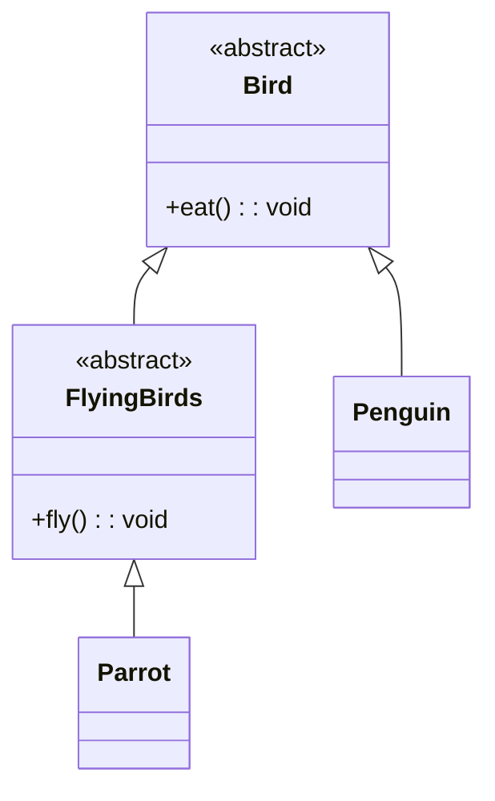

---

## 🧩 4. Interface Segregation Principle (ISP)
> **"Clients should not be forced to implement methods they do not need."**

### ❌ The Problem
A single shape contract forces 2D objects to implement `volume()`.

### ✅ The Solution
Split contracts by capability.

### ✂️ Short Example
```java
TwoDimensionalShape rectangle = new Rectangle(2, 2);
rectangle.area();

ThreeDimensionalShape cube = new Cube(2);
cube.area();
cube.volume();
```

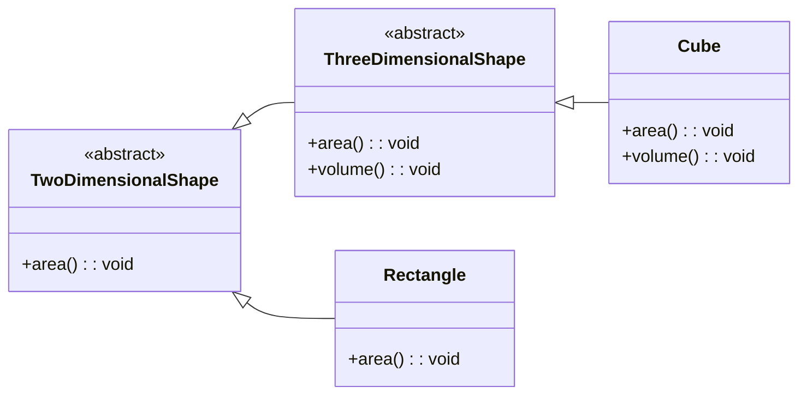

---

## 🔌 5. Dependency Inversion Principle (DIP)
> **"High-level modules should not depend on low-level modules. Both should depend on abstractions."**

### ❌ The Problem
High-level logic directly depends on concrete DB classes.

### ✅ The Solution
Depend on a persistence abstraction and inject implementations.

### ✂️ Short Example
```java
Application postgresApp = new Application(new PostgresDatabase());
postgresApp.saveToDatabase();

Application mongoApp = new Application(new MongoDatabase());
mongoApp.saveToDatabase();

Application cassandraApp = new Application(new CassandraDatabase());
cassandraApp.saveToDatabase();
```

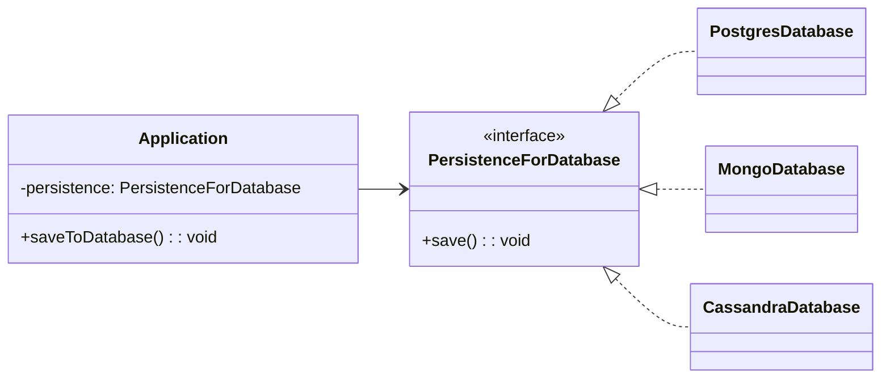

---

## 📝 Real-World Example: Document Editor
A combined example showing SOLID ideas together.

### Without SOLID (single class does too much)
```java
DocumentEditor editor = new DocumentEditor();
editor.addText("Hey I am Sid");
editor.addImage("profile.png");
StringBuilder output = editor.renderedDoc();
editor.saveDoc();
```
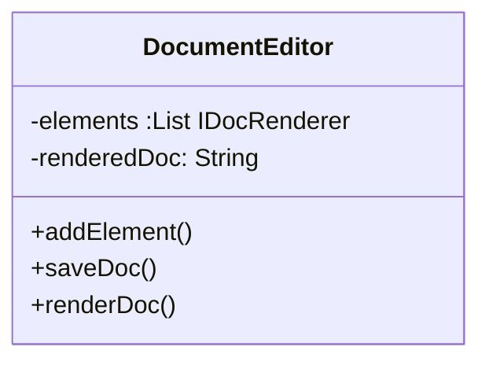

### With SOLID (separated contracts and implementations)
```java
DocumentEditor editor = new DocumentEditor(new Document(), new DocFilePersistence());
editor.addElement(new TextRenderer("Hey I am Sid"));
editor.addElement(new ImageRenderer("profile.png"));
StringBuilder output = editor.renderDoc();
editor.save();
```

### 🏗️ Architecture
* **Document:** Handles element management.
* **DocPersist:** Interface for saving (Postgres, File).
* **DocRenderer:** Interface for rendering different content types (Text, Image, Table).


With Solid
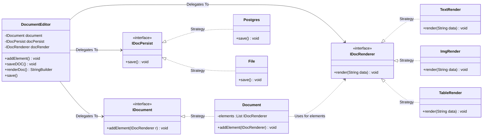

---

## 🧠 Quick Revision
- **SRP:** one responsibility per class.
- **OCP:** add new behavior via new class, not changing old class.
- **LSP:** child should not break parent expectations.
- **ISP:** smaller, role-specific contracts.
- **DIP:** high-level logic depends on abstraction, not concrete type.
