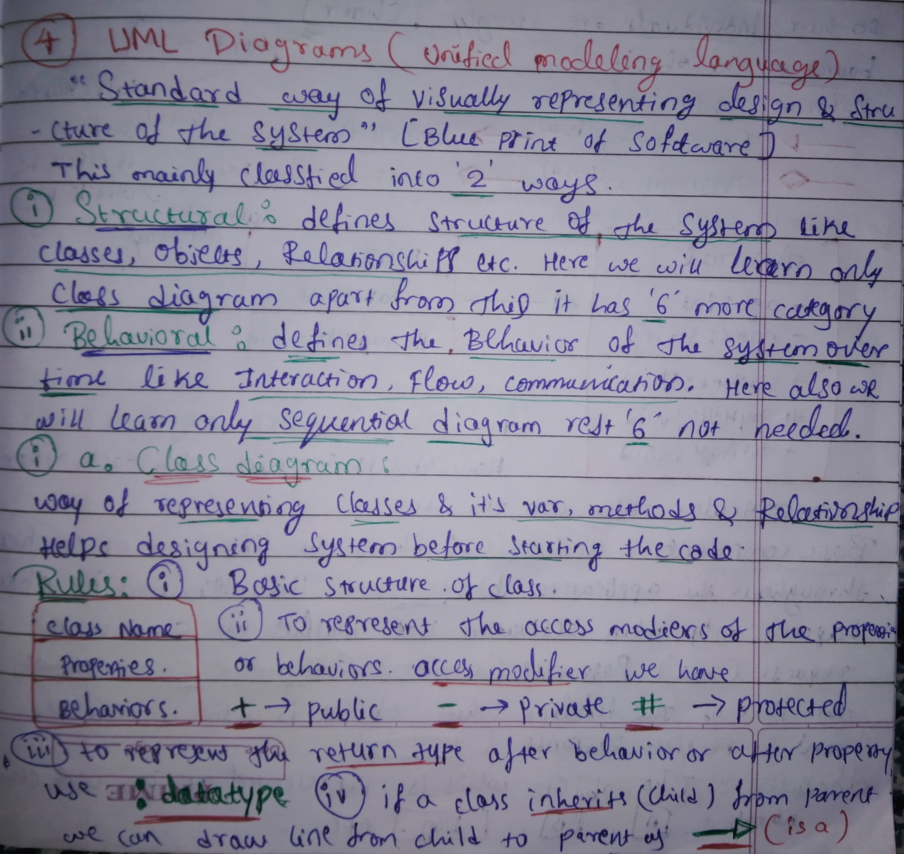
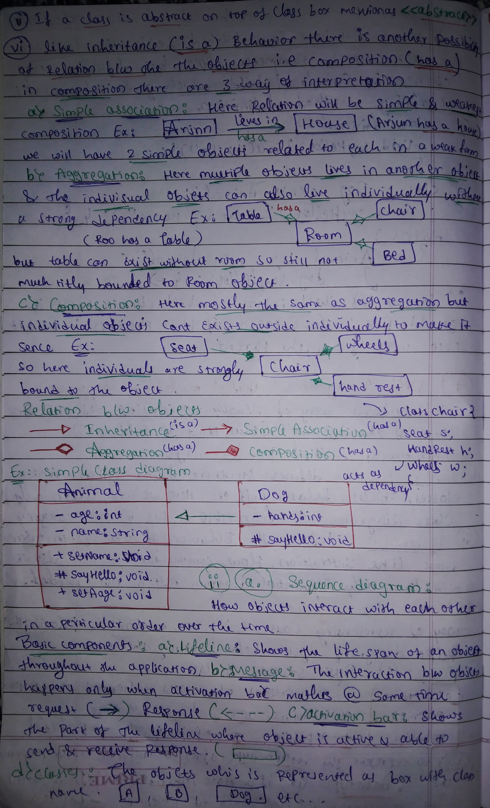
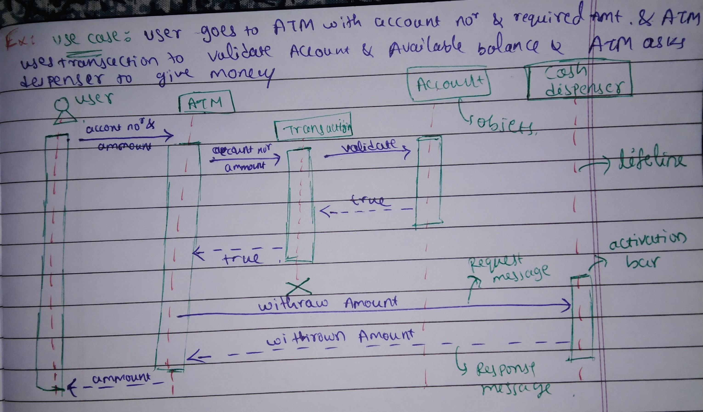
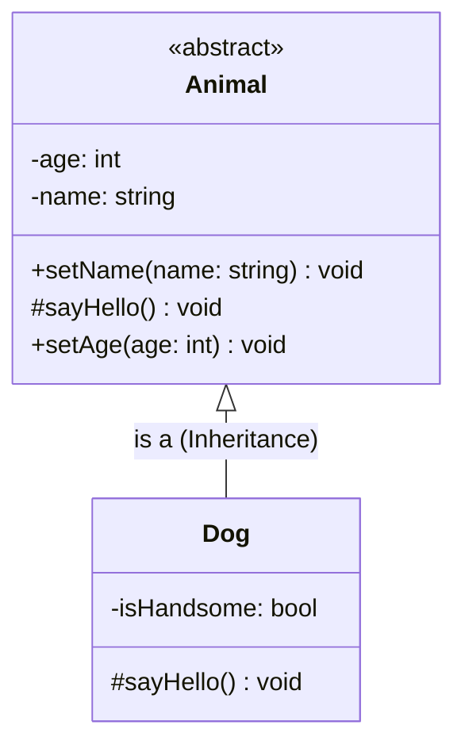
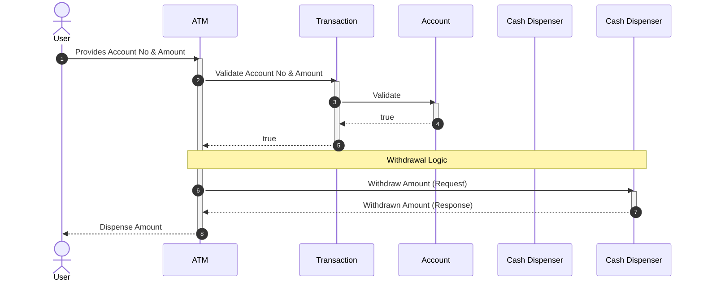

# 🏗️ Unified Modeling Language (UML) Guide

Notes:
Notes:

  </img> 
  </img> 
  </img>

    

UML is the **standard way of visually representing the design and structure of a system**. Think of it as the "Blue Print" of software development, allowing you to design the system before writing a single line of code.

UML is mainly classified into two categories:
1.  **Structural:** Defines the static structure (Classes, Objects, Relationships).
2.  **Behavioral:** Defines the dynamic behavior over time (Interactions, Flow, Communication).

---

## 1. Class Diagram (Structural) 🧱
A Class Diagram represents the classes, their variables (properties), methods (behaviors), and how they relate to one another.

### 📋 Basic Rules & Structure
* **Class Box:** Divided into three sections: **Class Name**, **Properties**, and **Behaviors**.
* **Access Modifiers:**
    * `+` 🟢 Public
    * `-` 🔴 Private
    * `#` 🟡 Protected
* **Data Types:** Represented after the property or behavior using a colon (e.g., `age : int`).
* **Abstract Classes:** Indicated with the `<<abstract>>` keyword.

### 🔗 Relationship Types
UML uses specific arrows to define how objects interact:

| Relationship | Type | Visual Representation | Description |
| :--- | :--- | :--- | :--- |
| **Inheritance** | "Is a" | `---▷` | Child inherits from Parent. |
| **Simple Association** | "Has a" | `--->` | Weakest relationship (e.g., Arjun lives in a House). |
| **Aggregation** | "Has a" | `---◇` | Objects can exist independently (e.g., Room has a Table). |
| **Composition** | "Has a" | `---◆` | Strong dependency; objects cannot exist alone (e.g., Chair has a Seat). |

### 🐾 Example: Animal & Dog Class Diagram

---

## 2. Sequence Diagram (Behavioral) ⏱️
Sequence Diagrams show how objects interact with each other in a particular order over time.

### 🧩 Basic Components
* **Lifeline:** Represented by a dashed vertical line, showing the lifespan of an object.
* **Activation Bar:** A thin rectangle on the lifeline showing when an object is active.
* **Messages:**
    * **Request:** Solid line with an arrow `->`
    * **Response:** Dashed line with an arrow `<--`
* **Actor/Object:** Represented as boxes at the top (e.g., User, ATM, Account).

### 🏧 Use Case: ATM Money Withdrawal

---

### 💡 Key Takeaways
* **Structural Diagrams** focus on *what* is in the system.
* **Behavioral Diagrams** focus on *how* the system works.
***